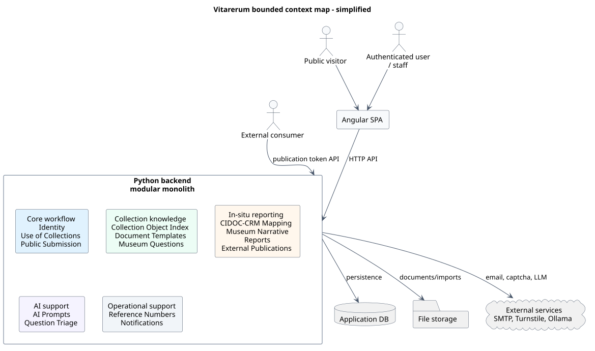

# Vitarerum

Vitarerum is a modular application for museum collection-use workflows. It
combines a FastAPI backend, an Angular SPA, and shared documentation for
architecture, API contracts, diagrams, deployment, and document templates.

The current application covers proposal intake, collection-use projects,
public proposal submission, public museum questions, in-situ visit records,
CIDOC-CRM mapping, reports, object data sources, document templates, external
publication links, notifications, identity/permissions, dashboards, and
AI-assisted narrative workflows.

## Repository Layout

- [vitarerum-api](./vitarerum-api/README.md): FastAPI modular monolith,
  database migrations, local PostgreSQL Compose setup, backend tests and
  architecture fitness checks.
- [vitarerum-ui](./vitarerum-ui/README.md): Angular 21 SPA, public and
  authenticated routes, runtime frontend configuration, unit and e2e tests.
- [docs](./docs/): architecture notes, API contracts, diagrams, deployment
  notes, and source document templates.
- [Dockerfile](./Dockerfile): production-oriented image that builds the
  Angular UI and serves it from the FastAPI runtime.
- [cloudbuild.yaml](./cloudbuild.yaml): Cloud Build pipeline for image build,
  migration job execution, and Cloud Run deployment.
- [cloudbuild.image.yaml](./cloudbuild.image.yaml): image-only Cloud Build
  pipeline for manual tags.

## Architecture At A Glance

The backend is a modular monolith. Bounded contexts live in one FastAPI process
and follow Clean Architecture layers. Cross-context communication is
synchronous through published-language modules and narrow ACLs, with dependency
rules enforced by import-linter contracts.

The production image is integrated: the Angular app is built first, copied into
`/app/static`, and served by FastAPI. API routes live under `/api/v1/*`; other
paths fall back to the Angular SPA when the static build is present.



## Local Development

Backend:

```bash
cd vitarerum-api
uv sync
cp .env.example .env
docker compose up -d postgres
uv run alembic upgrade head
docker compose exec -T postgres psql -U vitarerum -d vitarerum < scripts/seed.sql
uv run uvicorn app.main:app --reload
```

Frontend:

```bash
cd vitarerum-ui
npm ci
npm start
```

Default local URLs:

- API health: http://localhost:8000/api/v1/health
- Angular dev server: http://localhost:4200

Detailed setup and configuration live in the subproject READMEs linked above.

## Quality Gates

Backend:

```bash
cd vitarerum-api
uv run ruff check .
uv run mypy app
uv run lint-imports
uv run pytest
```

Frontend:

```bash
cd vitarerum-ui
npm run lint
npm test
npm run test:e2e
npm run build
```

`npm run test:e2e` starts its own Angular dev server on
`http://127.0.0.1:4201` through Playwright.

## Build And Deployment

For local backend-only container work, use the Compose setup in
[vitarerum-api](./vitarerum-api/README.md).

For the deployable application artifact, use the root [Dockerfile](./Dockerfile).
It builds both subprojects and serves the Angular build from FastAPI:

```bash
docker build -t vitarerum:local .
docker run --rm -p 8080:8080 -e APP_ENV=local vitarerum:local
```

Cloud Build configuration for the integrated image lives in
[cloudbuild.yaml](./cloudbuild.yaml), with runtime environment examples under
[docs/cloud](./docs/cloud/).

## Documentation Map

Architecture:

- [Architecture overview](./docs/architecture/README.md)
- [Module boundaries](./docs/architecture/module-boundaries.md)
- [Business flows](./docs/architecture/business-flows.md)
- [Architecture decisions](./docs/architecture/adr/README.md)

Contracts and flows:

- [API contracts](./docs/api_contracts/)
- [Business flows](./docs/architecture/business-flows.md): rendered flow and
  domain diagrams with links to the related API contracts.
- [Diagrams](./docs/diagrams/): rendered SVG files and PlantUML sources.

To regenerate the rendered diagrams from PlantUML sources:

```bash
java -jar /path/to/plantuml.jar -tsvg docs/architecture docs/diagrams
```

Planning and operations:

- [Cloud Run env example](./docs/cloud/vitarerum-cloudrun.env.example.yaml)

Implementation plans used during local development live under `docs/plans/`.
That directory is ignored by Git in this repository.

Templates:

- [Document templates](./docs/templates/)

## Operational Notes

The current deployment convention is one application instance per institution.
Do not document multi-institution behavior as a guaranteed domain invariant
unless the implementation is changed to enforce it.
