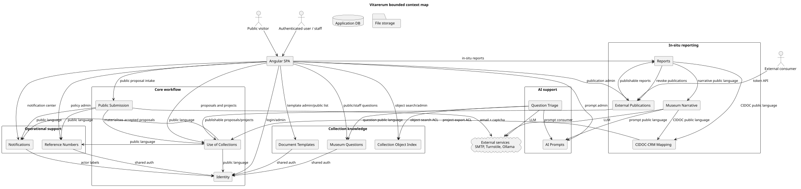

# Architecture

This directory documents the Vitarerum backend architecture at the level needed
to understand module ownership, cross-context communication, business flows, and
durable architecture decisions.

## Start Here

- Context map: bounded contexts and allowed cross-context communication.

- [Module boundaries](./module-boundaries.md): business responsibility of each
  active context.
- [Encryption contracts](./encryption-contracts.md): durable contracts for the
  strings that encryption authenticates — file references and encrypted-field
  associated data.
- [Business flows](./business-flows.md): index of end-to-end flows and existing
  diagrams.
- [Architecture decisions](./adr/README.md): ADR index and template.

## Related Sources

- [Backend agent guide](../../vitarerum-api/AGENTS.md): canonical developer and
  agent rules for backend architecture, security, testing, and code quality.
- [Backend README](../../vitarerum-api/README.md): backend setup, runtime
  configuration, migrations, and local commands.
- [Frontend README](../../vitarerum-ui/README.md): frontend setup and Angular
  commands.
- [API contracts](../api_contracts/): public HTTP contract documentation.
- [Diagrams](../diagrams/): existing PlantUML flow and domain diagrams.
- [Backend import-linter contracts](../../vitarerum-api/pyproject.toml):
  executable architecture rules for module dependencies.

## Architecture Position

Vitarerum is a modular monolith. Bounded contexts live in one deployable backend
process, but their dependencies are constrained by Clean Architecture layers and
by published-language modules such as `identity.public`,
`use_of_collections.public`, `cidoc_crm.public`, `museum_questions.public`, and
`ai.*.public`.

Cross-context integration is synchronous through those published interfaces and
narrow ACLs. The project does not currently use Event Bus, Outbox/Inbox, or
Event Sourcing as its integration model.
