# Business Flows

This is an index of end-to-end business flows, the diagrams that draw them and
the specifications that state their rules. When a flow is not yet diagrammed,
this file records the gap without inventing an incomplete diagram.

Endpoint-level HTTP documentation is the generated OpenAPI schema; what is
shared by every endpoint is in the
[cross-cutting contract](../api_contracts/README.md).

## Proposal Intake and Lifecycle

- Public proposal submission:
  [SPEC-010](../specs/010-submissao-publica/spec.md).

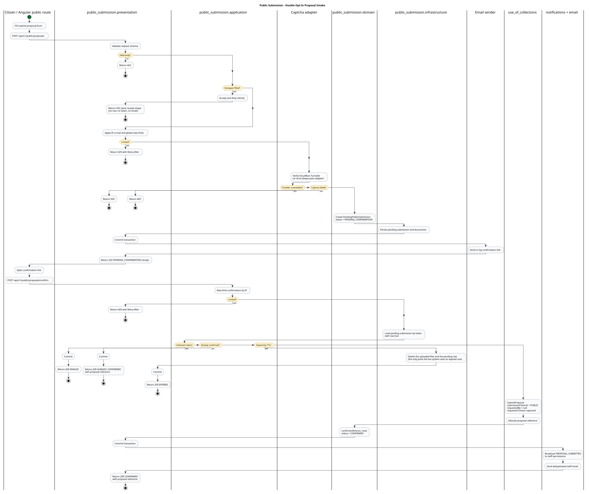

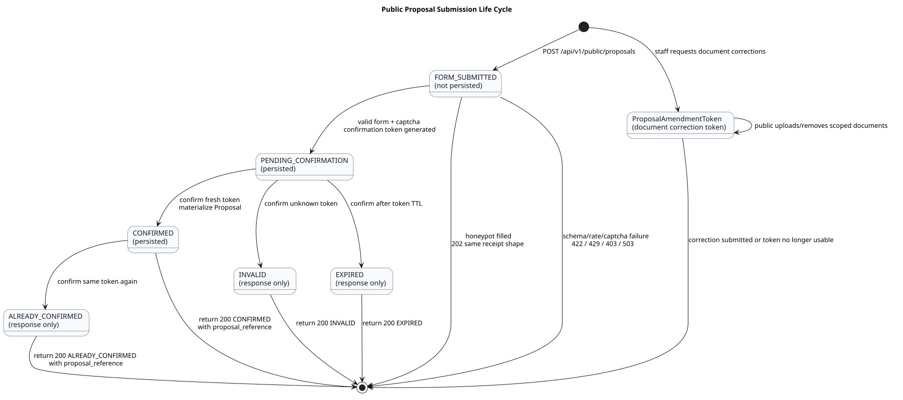

- Authenticated proposal submission:
  [SPEC-008](../specs/008-proposta-uso-de-colecoes/spec.md).
- Proposal origin identification: documented by
  [ADR 0001](./adr/0001-submission-channel.md).
- Proposal lifecycle:
  [SPEC-008](../specs/008-proposta-uso-de-colecoes/spec.md).

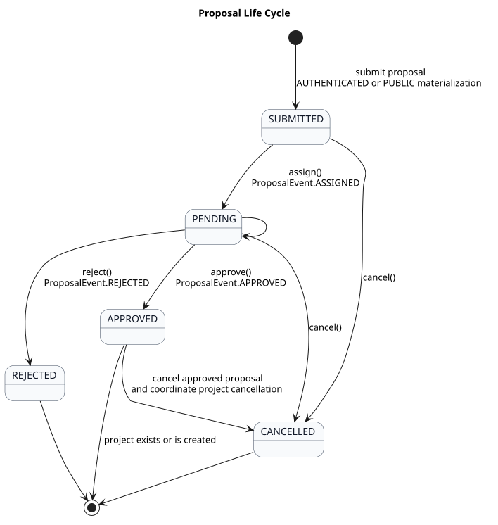

- Document correction and attachments: covered by
  [SPEC-008](../specs/008-proposta-uso-de-colecoes/spec.md) and the public
  submission/amendment states above.
- Staff notifications triggered by proposal events:

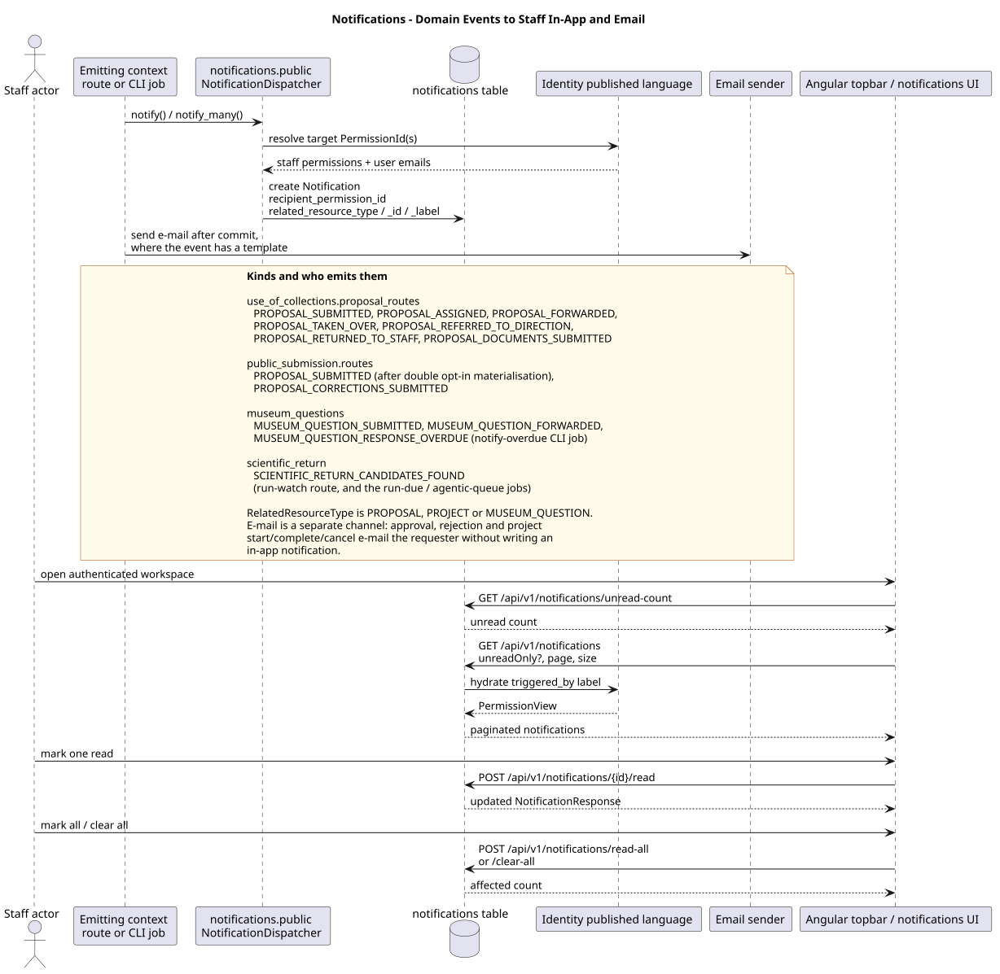

## Collection Use Projects

- Project lifecycle:
  [SPEC-009](../specs/009-projeto-uso-de-colecoes/spec.md).

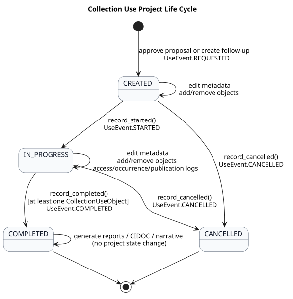

- Object search and requested-object snapshots:
  [SPEC-014](../specs/014-catalogo-e-indice-de-objetos/spec.md).
  A dedicated end-to-end diagram for object selection is still to document.
- Reference number policy administration:

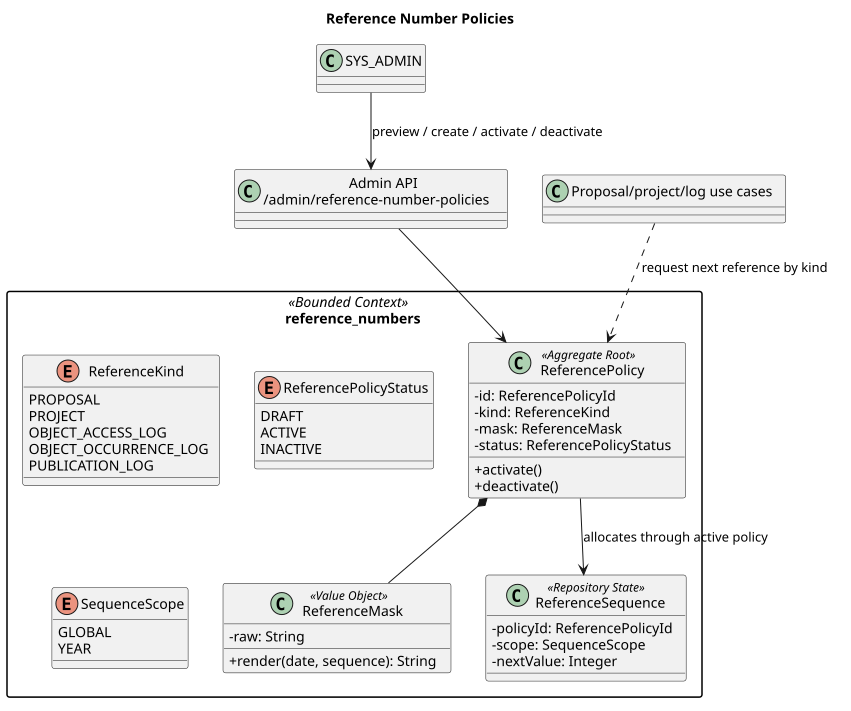

## In-Situ Visit, CIDOC-CRM, and Narrative

- In-situ visit to CIDOC/narrative flow:

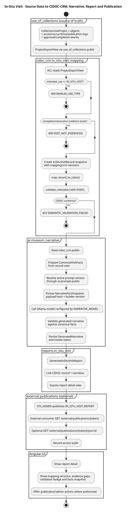

- In-situ visit context map:

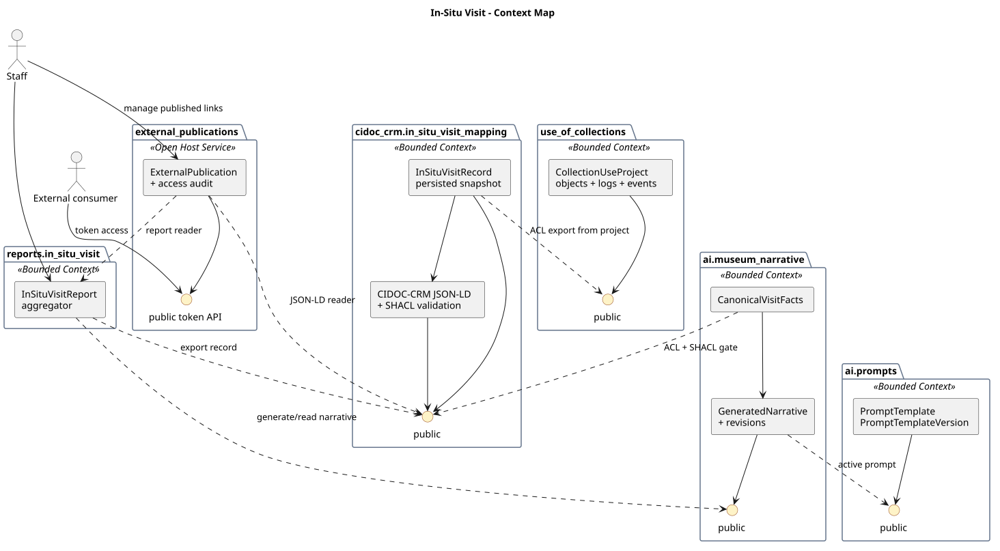

- CIDOC-CRM mapping:
  [SPEC-013](../specs/013-mapeamento-cidoc-crm/spec.md).

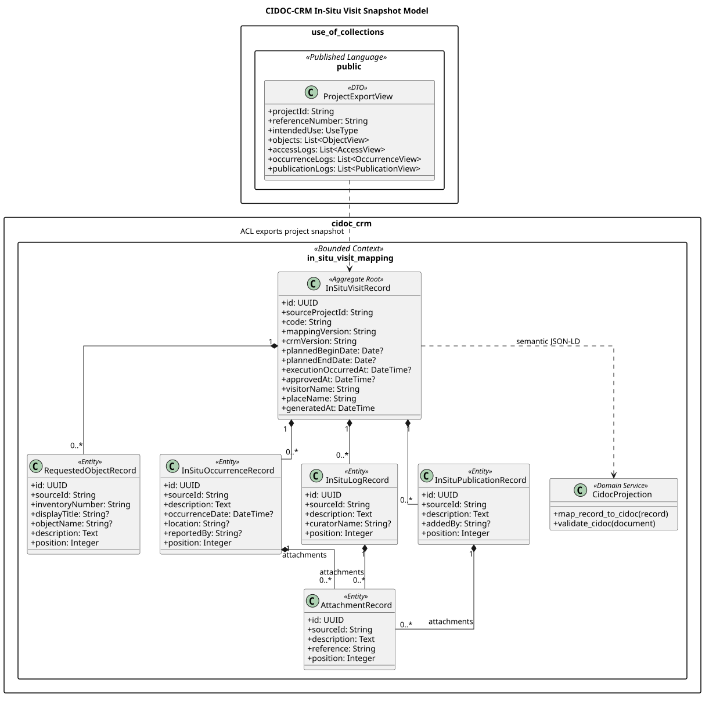

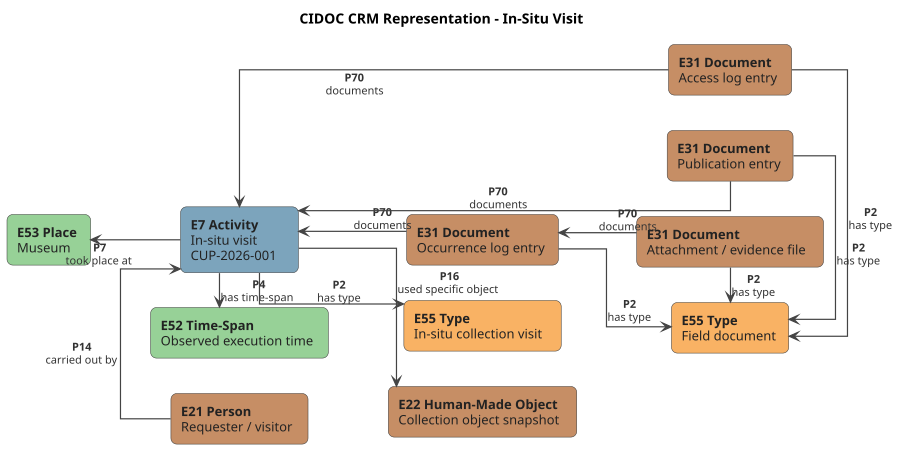

- Narrative generation:
  [SPEC-017](../specs/017-narrativa-museologica/spec.md).
- Report aggregation:
  [SPEC-015](../specs/015-relatorio-visita-in-situ/spec.md).
- External publication of reports and JSON-LD:

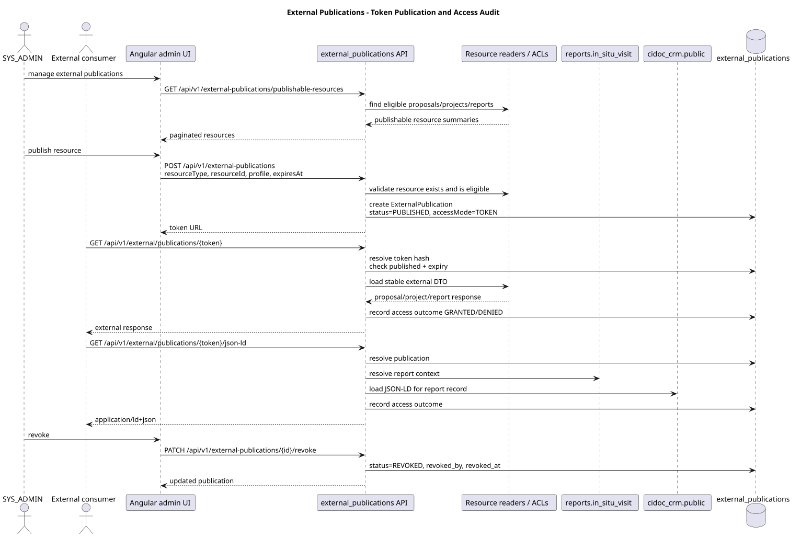

## Scientific Return

The largest flow in the system, and the newest. Rules and invariants live in
[SPEC-001](../specs/001-investigacao-agentica-assistida/spec.md) through
[SPEC-006](../specs/006-avaliacao-retorno-cientifico/spec.md),
[SPEC-024](../specs/024-investigacao-agentica-autonoma/spec.md) and
[SPEC-025](../specs/025-base-de-conhecimento-curatorial/spec.md); the reading
order is in the [specifications index](../specs/README.md).

- Coexisting flows and the full-agentic cycle:

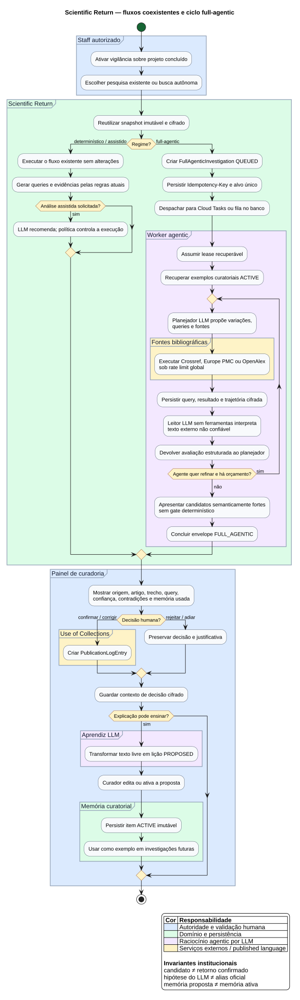

- The exclusively autonomous cycle:

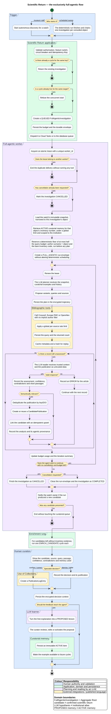

- Autonomous search, from trigger to curatorial decision:

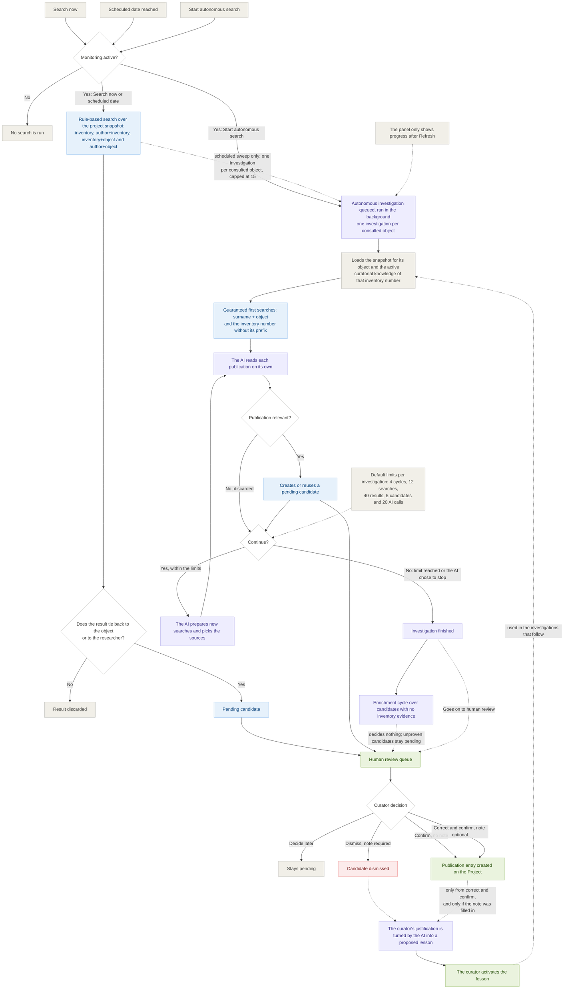

## Museum Questions

- Public question submission:
  [SPEC-011](../specs/011-perguntas-ao-museu/spec.md).

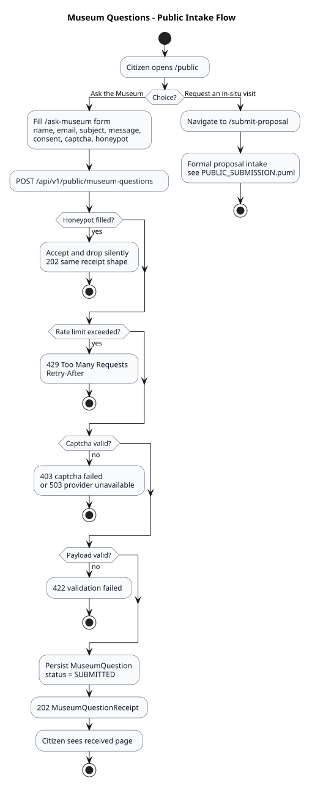

- Staff response: same spec, staff-facing requirements.

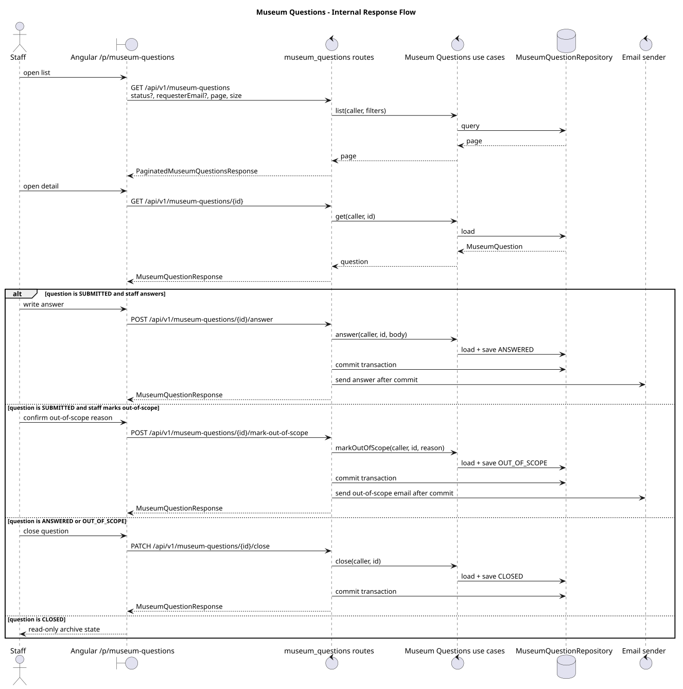

## Administration

- Document templates:
  [SPEC-012](../specs/012-modelos-de-documento/spec.md).
- Collection data sources and catalog administration:
  [SPEC-014](../specs/014-catalogo-e-indice-de-objetos/spec.md).
- AI prompts:
  [SPEC-016](../specs/016-prompts-versionados/spec.md).

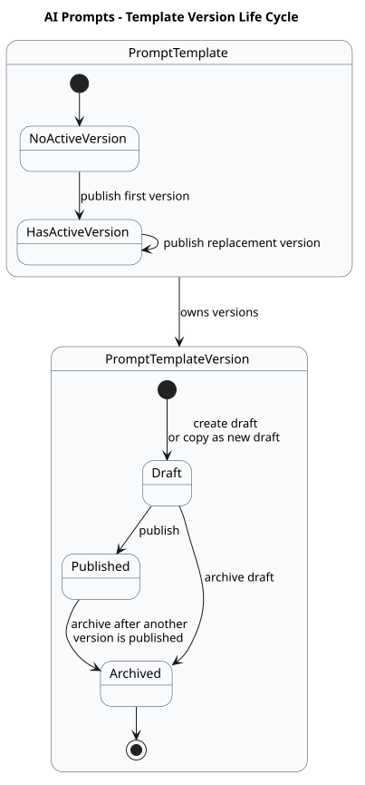

- Dashboard summary: the `/p/dashboard` page is served by existing list
  endpoints. Dedicated summary endpoints are proposed but not implemented -
  see [Dashboard Summary API (proposed)](../proposals/17Dashboard-Summary-API.md)
  and [SPEC-021](../specs/021-resumos-de-painel/spec.md).

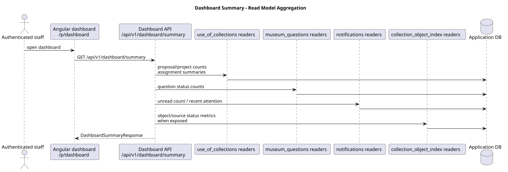

- External publication administration:

