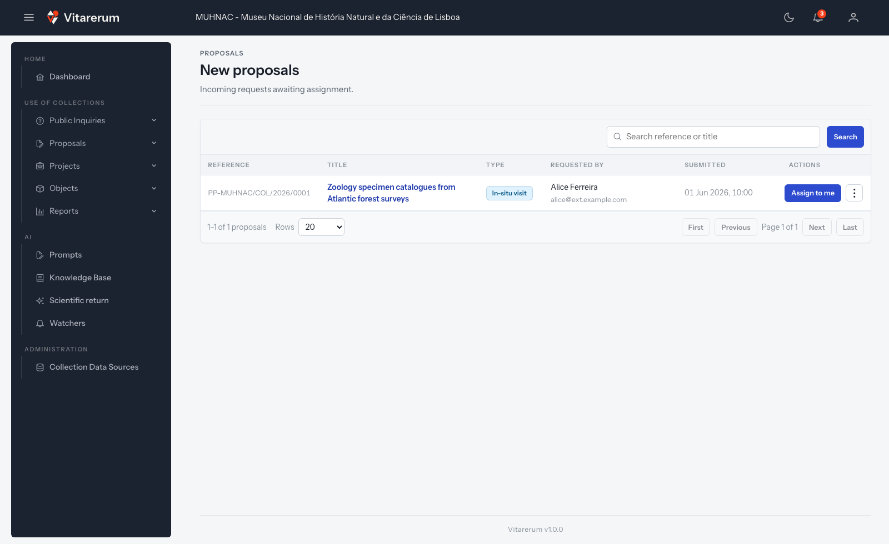

# Como receber e assumir uma proposta

## Objetivo

Localizar uma proposta recém-submetida, rever a informação inicial e assumi-la
para iniciar o tratamento.

**Disponível para:** COLLECTIONS_MANAGEMENT e CURATORIAL

**Onde começar:** **“Use of Collections”** > **“Proposals”** > **“New proposals”**

**Tempo aproximado:** 3 minutos

## Antes de começar

A proposta deve estar no estado **“Submitted”** e ainda não pode ter sido
assumida por outra pessoa.

## Passo a passo

*Figura 1 — Localização da ação para assumir uma proposta nova.*

1. Abra **“New proposals”**.
2. Procure por referência ou título em **“Search reference or title”** e
   selecione **“Search”**, se necessário.
3. Reveja na linha da tabela a referência, o título, o tipo de utilização, o
   requerente e a data de submissão.
4. Selecione a referência para abrir o detalhe antes de decidir, ou selecione
   diretamente **“Assign to me”**.
5. Na confirmação **“Assign to me?”**, selecione novamente **“Assign to me”**.
6. Abra **“My assignments”** para continuar o tratamento.

## Resultado esperado

A proposta muda de **“Submitted”** para **“Under review”**, deixa de aparecer em
**“New proposals”**, passa para **“My assignments”** e regista a atribuição no
histórico de eventos.

## Atenção

> Se a proposta deve ser tratada diretamente por outra pessoa, use **“Forward”**
> e escolha **“Staff member”**. A nota é opcional, mas deve explicar informação
> útil para a transferência.

## Se algo não funcionar

| Situação | O que verificar ou fazer |
| --- | --- |
| A proposta desapareceu da fila | Outra pessoa pode tê-la assumido; procure em **“Other's assignments”** |
| **“Assign to me”** falha | Atualize a página e confirme que a proposta ainda está **“Submitted”** |
| A proposta não aparece em **“My assignments”** | Confirme o papel ativo usado no momento da atribuição |

## Tarefas relacionadas

- [Analisar, pedir documentos e decidir uma proposta](analisar-decidir-proposta.md)
- [Manual do Utilizador — gestão de propostas](../../user-manual.md#11-gestão-de-propostas)
- [Índice dos guias práticos](../README.md)
