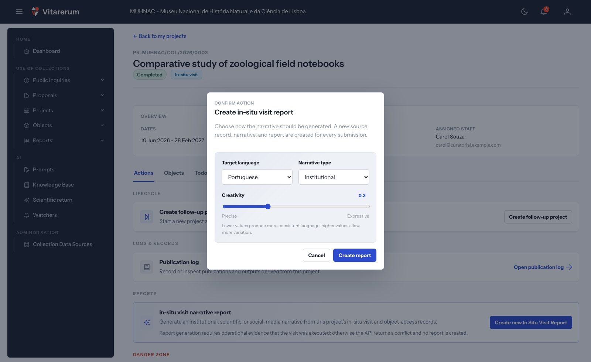

# Como criar, rever e exportar um relatório de visita in situ

## Objetivo

Gerar uma narrativa a partir dos registos de uma visita concluída, rever o
conteúdo e exportar ou imprimir o relatório com proveniência verificável.

**Disponível para:** COLLECTIONS_MANAGEMENT e CURATORIAL para criar o
relatório; DIRECTION consulta, exporta e imprime, mas não vê a ação de criação

**Onde começar:** detalhe de um projeto de visita in situ > **“Actions”**

**Tempo aproximado:** 10 minutos, além do tempo de geração

## Antes de começar

- O projeto deve corresponder a uma visita in situ concluída.
- Deve existir evidência operacional suficiente: objetos e registos que
  demonstrem a execução da visita.
- Reveja acessos, ocorrências, publicações e anexos antes de gerar o relatório.

## Criar o relatório

*Figura 1 — As três opções de geração do relatório.*

1. Abra o projeto concluído e selecione **“Actions”**.
2. Em **“Reports”**, selecione **“Create new In Situ Visit Report”**.
3. Escolha **“Target language”**: **“Portuguese”** ou **“English”**.
4. Escolha **“Narrative type”**: **“Institutional”**, **“Scientific”**,
   **“Audioguide (adult)”**, **“Audioguide (child)”** ou **“Social media”**.
5. Ajuste **“Creativity”** entre **“Precise”** e **“Expressive”**.
6. Selecione **“Create report”** e aguarde a conclusão.
7. Abra a ligação apresentada em **“In-situ visit report created”**.

Cada submissão cria um relatório independente; gerar novamente não substitui
os anteriores.

## Rever e corrigir

1. Leia **“Interpretive account”** e compare afirmações, nomes, datas e objetos
   com **“Evidence register”**.
2. Consulte **“Evidence gaps”** e **“CIDOC mapping”**.
3. Para corrigir a narrativa, selecione **“Edit narrative”**.
4. Altere **“Narrative text”**, reveja e guarde. A revisão fica no histórico.
5. Abra **“Audit trail”** para consultar evidência, CIDOC-CRM, factos usados,
   parâmetros, validação e revisões.

## Exportar ou imprimir

- Selecione **“Export”** para descarregar o conteúdo simples em JSON.
- Selecione **“Print”** para abrir a impressão do navegador e, se necessário,
  escolher uma impressora PDF.

A aplicação ainda não disponibiliza uma exportação PDF própria deste relatório.

## Resultado esperado

O novo relatório aparece no histórico de **“Reports”** e mantém a narrativa, o
registo de evidência, os parâmetros de geração e o trilho de auditoria. As
correções manuais ficam registadas como revisões.

## Atenção

> A narrativa é assistida por IA e deve ser revista por uma pessoa antes de uso
> institucional ou publicação. O registo de evidência é a referência factual.

> Valores mais altos de criatividade permitem maior variação de linguagem; não
> acrescentam evidência e não dispensam validação.

## Se algo não funcionar

| Situação | O que verificar ou fazer |
| --- | --- |
| A ação de relatório não aparece | Confirme que é uma visita in situ concluída e que o papel ativo é COLLECTIONS_MANAGEMENT ou CURATORIAL |
| A criação devolve um conflito | Complete os registos operacionais que comprovam a visita e tente novamente |
| A geração demora | Aguarde a resposta; não repita a submissão, pois cada tentativa concluída cria outro relatório |
| Precisa de PDF | Use **“Print”** e escolha a opção PDF do navegador; **“Export”** produz JSON |

## Tarefas relacionadas

- [Registar acessos, ocorrências e publicações](../investigador/registar-atividade-projeto.md)
- [Criar, testar e publicar uma versão de prompt](gerir-prompts.md)
- [Manual do Utilizador — relatórios](../../user-manual.md#16-relatórios-pcollectionsreportsvisits-in-situ)
- [Índice dos guias práticos](../README.md)
