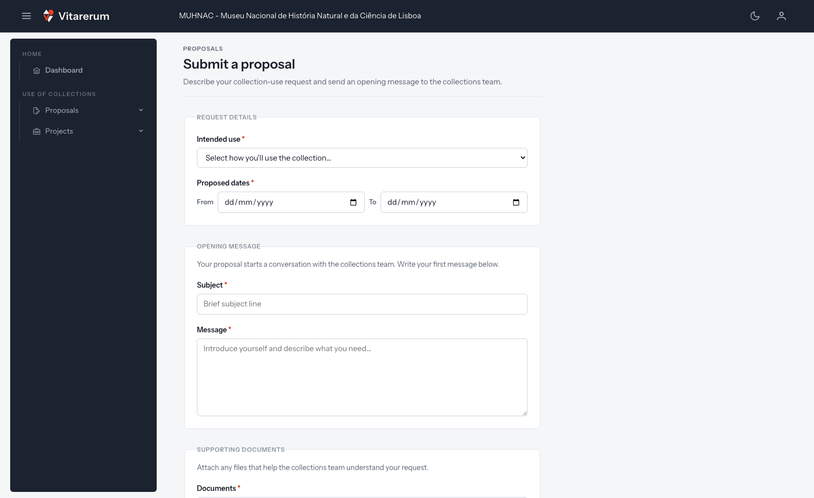

# Como submeter e acompanhar uma proposta autenticada

## Objetivo

Apresentar um pedido de visita *in situ* através da sua conta e acompanhar a
análise, os responsáveis, as mensagens e o histórico da proposta.

**Disponível para:** EXTERNAL

**Onde começar:** **“Use of Collections”** > **“Proposals”** > **“Submit
proposal”**

**Tempo aproximado:** 10 a 20 minutos, além do tempo necessário para preparar os
documentos

## Antes de começar

- Inicie sessão com a conta associada ao pedido.
- Confirme que o papel ativo é **EXTERNAL**, caso tenha mais de um papel.
- Prepare as datas pretendidas e uma descrição do que deseja consultar.
- Prepare entre 1 e 5 ficheiros em PDF, JPG, JPEG, PNG ou DOCX, até 10 MB cada.

Se aparecerem modelos em **“Required documents”**, descarregue-os, preencha-os
e prepare as versões preenchidas para anexar.

## Submeter uma proposta

### 1. Indicar os detalhes do pedido

*Figura 1 — As três secções do formulário de proposta autenticada.*

1. No menu lateral, abra **“Use of Collections”** e depois **“Proposals”**.
2. Selecione **“Submit proposal”**.
3. Em **“Intended use”** (utilização pretendida), escolha **“In-situ visit”**.
   **“Exhibition”** e **“Other”** ainda não estão operacionais e impedem a
   submissão.
4. Se a página apresentar **“Required documents”**, descarregue e preencha os
   modelos aplicáveis.
5. Em **“Proposed dates”**, indique a data inicial em **“From”** e a final em
   **“To”**. A data final não pode ser anterior à inicial.

### 2. Escrever a mensagem de abertura

1. Em **“Subject”**, escreva um assunto curto que permita identificar o pedido.
2. Em **“Message”**, apresente-se e explique:
   - a coleção ou os objetos que pretende consultar;
   - o objetivo da investigação;
   - o uso previsto para a informação ou os objetos;
   - qualquer condição relevante para a visita.

Esta mensagem inicia a conversação da proposta. Não é apenas uma observação do
formulário: ficará visível no histórico de mensagens trocadas com a equipa.

Não precisa de conhecer os números de inventário. A proposta é criada sem
objetos associados e a equipa poderá acrescentá-los depois da submissão.

### 3. Anexar e enviar

1. Em **“Documents”**, selecione entre 1 e 5 ficheiros comprovativos.
2. Confirme a lista de ficheiros e os respetivos tamanhos.
3. Use **“Remove”** junto de um ficheiro selecionado por engano.
4. Selecione **“Submit proposal”** uma única vez e aguarde.

Como já iniciou sessão, não precisa de confirmar a submissão por email. A
proposta é criada imediatamente e a aplicação abre o respetivo detalhe.

## Acompanhar a proposta

### 1. Encontrar as suas propostas

1. Abra **“Use of Collections”** > **“Proposals”**.
2. Selecione **“My proposals”**.
3. Use **“Search reference or title”** para pesquisar pelo número de referência
   ou pelo título e selecione **“Search”**.
4. Se necessário, altere **“Rows”** ou use **“First”**, **“Previous”**,
   **“Next”** e **“Last”** para navegar entre páginas.
5. Selecione o título da proposta ou abra o menu de ações e escolha
   **“Details”**.

### 2. Interpretar o estado

| Estado apresentado | Significado |
| --- | --- |
| **“Submitted”** | A proposta foi recebida e ainda não está em análise ativa |
| **“Under review”** | A proposta foi atribuída e está a ser analisada |
| **“Approved”** | A proposta foi aprovada e originou um projeto |
| **“Rejected”** | A proposta foi recusada; consulte as mensagens e o histórico para conhecer a decisão |
| **“Cancelled”** | A proposta foi cancelada e já não prossegue |

### 3. Consultar o detalhe

No detalhe da proposta pode consultar:

- **“Overview”** — número de referência, título, tipo, estado, requerente,
  responsável atual e data de submissão;
- **“Conversation”** — mensagem inicial, respostas e anexos;
- **“Event log”** — registo cronológico de submissão, atribuição, pedidos de
  documentos, decisão e outras alterações relevantes.

Se **“Assigned to”** mostrar **“Unassigned”**, a proposta ainda não tem um
responsável. A resposta através da conversação só fica disponível depois de a
proposta ser atribuída.

## Cancelar uma proposta

1. Abra **“My proposals”**.
2. Na linha da proposta, abra o menu **“Actions”**.
3. Selecione **“Cancel proposal”**.
4. Leia o aviso e introduza um motivo em **“Reason”**.
5. Para confirmar, selecione novamente **“Cancel proposal”**. Para desistir,
   escolha **“Keep proposal”**.

A ação está disponível quando a proposta aparece como **“Submitted”**,
**“Under review”** ou **“Approved”**. Não está disponível para propostas
rejeitadas ou já canceladas.

## Resultado esperado

Depois da submissão, o detalhe apresenta um número de referência, o estado
**“Submitted”**, a mensagem de abertura e o primeiro evento do histórico.

O formato da referência é definido pela máscara ativa para propostas. A máscara
institucional em uso produz referências como `PP-MUHNAC/COL/2026/0007`.

A evolução pode ser acompanhada em **“My proposals”**. Se a proposta for
aprovada, o sistema cria um projeto associado, que fica disponível em **“My
projects”**.

## Atenção

> Cancelar uma proposta é irreversível. Se já existir um projeto associado,
> esse projeto também será cancelado, mesmo que já esteja concluído.

> A submissão de uma proposta não cria imediatamente um projeto. O projeto só
> é criado se a proposta for aprovada por Curadoria.

## Se algo não funcionar

| Situação | O que verificar ou fazer |
| --- | --- |
| **“Submit proposal”** não aparece no menu | Confirme que o papel ativo é **EXTERNAL** |
| A utilização pretendida impede a submissão | Escolha **“In-situ visit”**; os outros tipos ainda não estão operacionais |
| Um documento é recusado | Confirme o formato, o limite de 10 MB e o máximo de cinco ficheiros |
| A proposta não aparece na pesquisa | Limpe a pesquisa, confirme a referência ou o título e verifique se está a usar o mesmo papel com que submeteu |
| Não consegue responder na conversação | Aguarde que a proposta seja atribuída; o detalhe apresenta **“Unassigned”** enquanto não existir destinatário |
| **“Cancel proposal”** não aparece | A proposta pode estar rejeitada ou já cancelada, ou não ter sido submetida pelo papel ativo |

## Tarefas relacionadas

- [Responder à equipa e enviar documentos](responder-enviar-documentos.md)
- [Iniciar, utilizar, concluir ou cancelar um projeto](gerir-projeto.md)
- [Manual do Utilizador — propostas autenticadas](../../user-manual.md#7-submeter-uma-proposta-autenticada-pcollectionsproposalssubmit)
- [Índice dos guias práticos](../README.md)
