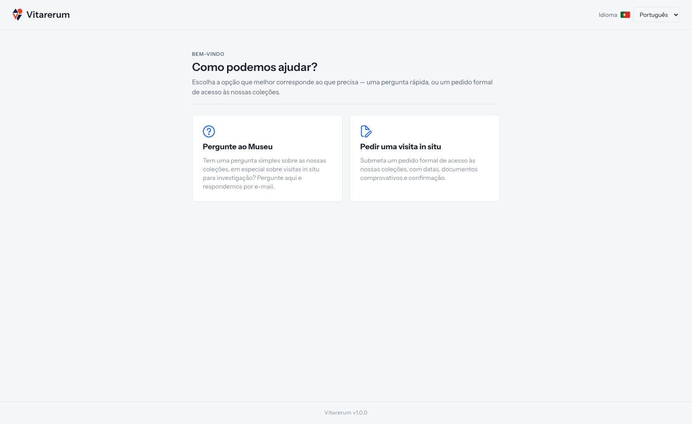

# Como escolher o canal certo para contactar o museu

## Objetivo

Escolher entre enviar uma pergunta simples ao museu e apresentar um pedido
formal de visita *in situ* para acesso às coleções.

**Disponível para:** público sem autenticação

**Onde começar:** página pública `/public`

**Tempo aproximado:** 1 minuto

## Antes de começar

Não precisa de ter uma conta nem de iniciar sessão. Pense no resultado de que
necessita: apenas uma resposta por email ou a análise formal de um pedido de
acesso às coleções.

## Qual opção devo escolher?

*Figura 1 — As duas opções da página de entrada pública.*

| Se precisa de… | Escolha | O que acontece depois |
| --- | --- | --- |
| Esclarecer uma dúvida simples sobre o uso das coleções | **“Pergunte ao Museu”** | A equipa analisa a pergunta e responde uma vez por email |
| Saber se uma visita para investigação pode ser possível antes de preparar um pedido | **“Pergunte ao Museu”** | Recebe orientação por email, sem abrir uma proposta formal |
| Pedir formalmente uma visita *in situ* para investigação | **“Pedir uma visita in situ”** | Preenche datas, mensagem e documentos comprovativos |
| Apresentar documentação para avaliação e obter uma decisão formal | **“Pedir uma visita in situ”** | O pedido entra na fila da equipa depois da confirmação por email |
| Acompanhar uma proposta ou projeto que já existe | Inicie sessão | Consulte **“My proposals”** ou **“My projects”** na área autenticada |

Atualmente, **“Pergunte ao Museu”** destina-se a perguntas sobre o uso de
coleções, sobretudo visitas *in situ* para investigação. Perguntas sobre
exposições, empréstimos, eventos, atividades educativas ou outros serviços
podem ser recebidas pelo sistema, mas serão encerradas com uma resposta por
email a informar que estão fora do âmbito deste canal.

O pedido formal disponível ao público é, neste momento, o de visita *in situ*.
Outros tipos de utilização podem aparecer no formulário, mas ainda não estão
operacionais.

## Passo a passo

1. Abra a página `/public`.
2. Se necessário, use o seletor **“Idioma”** no topo da página para escolher
   **“Português”** ou **“Inglês”**.
3. Leia as duas opções apresentadas em **“Como podemos ajudar?”**.
4. Escolha **“Pergunte ao Museu”** se pretende uma resposta simples por email.
5. Escolha **“Pedir uma visita in situ”** se pretende iniciar um pedido formal,
   com datas e documentos comprovativos.

## Resultado esperado

- **“Pergunte ao Museu”** abre o formulário onde pode escrever a pergunta e,
  opcionalmente, anexar imagens.
- **“Pedir uma visita in situ”** abre o formulário de pedido formal, que exige
  dados de contacto, datas, mensagem, documentos, consentimento e confirmação
  posterior por email.

Escolher uma opção apenas abre o respetivo formulário. Nenhuma informação é
enviada até concluir e submeter esse formulário.

## Atenção

> Uma pergunta não cria uma proposta, não recebe número de referência e não
> permite acompanhar um estado na página pública. Se precisa de uma decisão
> formal sobre acesso às coleções, utilize **“Pedir uma visita in situ”**.

## Se algo não funcionar

| Situação | O que verificar ou fazer |
| --- | --- |
| A página aparece em inglês | Use o seletor **“Language”** no topo e escolha **“Portuguese”** |
| Escolheu a opção errada, mas ainda não enviou | Regresse a `/public` e escolha o outro canal |
| Enviou uma pergunta quando precisava de um pedido formal | Faça um novo pedido através de **“Pedir uma visita in situ”**; a pergunta enviada não é convertida automaticamente |
| Já tem conta e quer acompanhar o processo | Inicie sessão e use as opções **“My proposals”** ou **“My projects”** |
| Precisa de outro serviço do museu | Utilize o canal institucional indicado pelo museu; este portal público está focado no uso de coleções |

## Tarefas relacionadas

- [Submeter e confirmar um pedido de acesso às coleções](submeter-pedido-acesso.md)
- [Enviar uma pergunta ao museu](perguntar-ao-museu.md)
- [Manual do Utilizador — acesso público](../../user-manual.md#parte-ii--acesso-público-sem-autenticação)
- [Índice dos guias práticos](../README.md)
