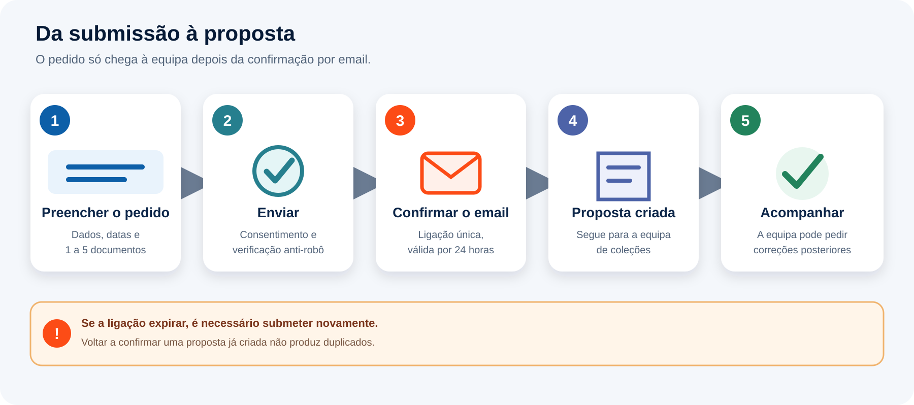
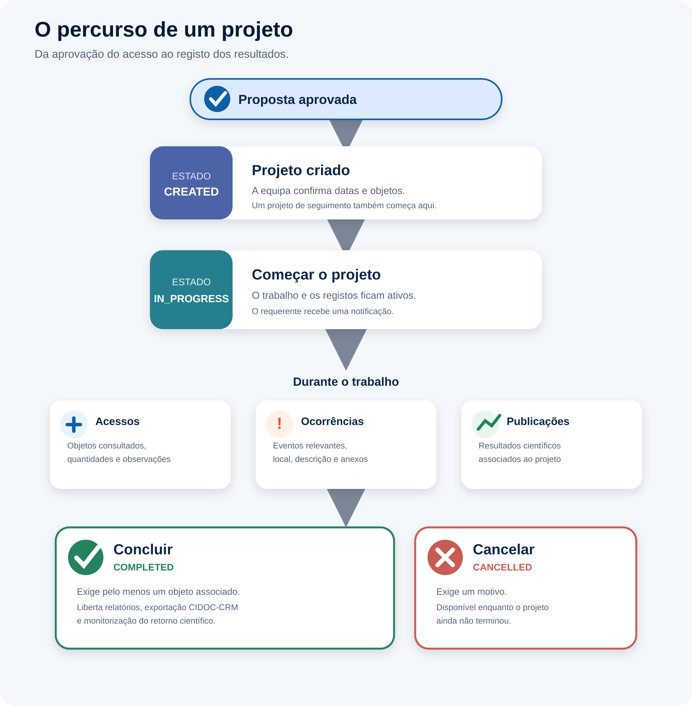
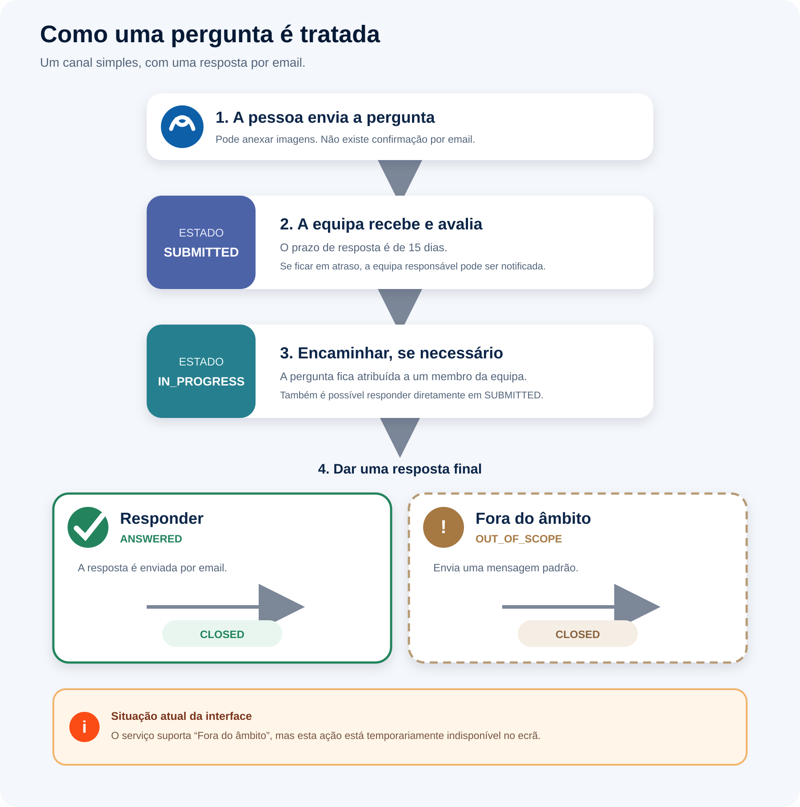
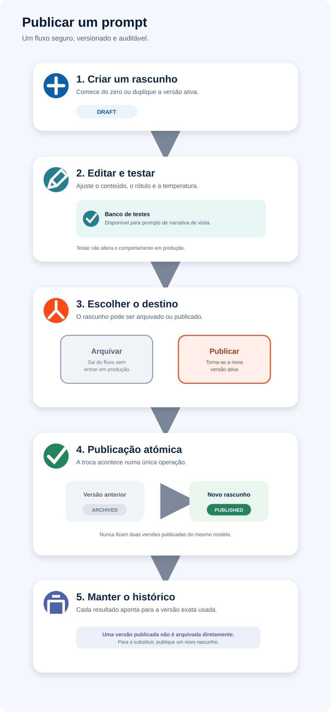

# Manual do Utilizador — Vitarerum

> Versão 0.1 — revista em 6 de setembro de 2026
> Idioma: PT-PT

Este manual descreve as funcionalidades visíveis na aplicação. Detalhes de
implementação, contratos HTTP e procedimentos de implantação encontram-se na
documentação técnica do repositório.

## Índice

**Parte I — Introdução**

1. O que é o Vitarerum
2. Perfis de utilizador e o que cada um pode fazer
3. Acesso ao sistema

**Parte II — Acesso Público (sem autenticação)**

4. Página de entrada pública
5. Submeter uma proposta de uso de coleção (pedido público)
6. "Pergunte ao Museu": submeter uma pergunta pública

**Parte III — Investigador/Proponente (conta autenticada)**

7. Submeter uma proposta autenticada
8. Acompanhar "As minhas propostas"
9. Conversação e troca de documentos com a equipa do museu
10. Projetos de uso de coleções

**Parte IV — Equipa do Museu (Gestão de Coleções / Curatorial)**

11. Gestão de propostas
12. Gestão de projetos
13. Pesquisa de objetos de coleção
14. Perguntas públicas ("Public Inquiries")
15. Visitas *in situ* e registo CIDOC-CRM
16. Relatórios

**Parte V — Inteligência Artificial e retorno científico**

17. Prompts de IA
18. Retorno científico
19. Watchers de retorno científico
20. Base de conhecimento
21. Boas práticas

**Parte VI — Administração (Administrador de Sistema)**

22. Gestão de utilizadores
23. Gestão de grupos/permissões
24. Gestão de instituições
25. Modelos de documentos
26. Fontes de dados de coleção
27. Máscaras de número de referência
28. Acesso a Recursos Externos

**Parte VII — Funcionalidades Transversais**

29. Notificações internas
30. Painel (Dashboard)
31. Estados e ciclos de vida (glossário)

**Anexos**

A. Glossário de termos
B. Perguntas frequentes
C. Resolução de problemas comuns
D. Contactos e suporte

### Percursos de leitura rápida

Não é necessário ler o manual de princípio a fim. Comece pela Parte I e siga o
percurso correspondente ao seu papel:

- público sem conta: Parte II;
- investigador ou proponente autenticado: Parte III;
- Gestão de Coleções ou Curadoria: Partes IV e V;
- Direção: secção 11.4, secção 12 e Parte V;
- Administração de Sistema: Parte VI.

As notificações, o Dashboard, os estados, as perguntas frequentes e a resolução
de problemas podem ser consultados apenas quando necessário.

---

## Parte I — Introdução

### 1. O que é o Vitarerum

O Vitarerum é o sistema de gestão de pedidos de uso de coleções museológicas. Cobre o percurso desde o pedido inicial (público ou autenticado)
até ao projeto de investigação em curso, incluindo:

- Receção e avaliação de propostas de uso de coleções
- Gestão de projetos de uso de coleções
- Pesquisa de objetos de coleção
- Perguntas públicas dirigidas ao museu ("Pergunte ao Museu") e resposta pela equipa
- Geração de narrativas assistida por IA a partir dos registos *in situ*
- Acompanhamento de tarefas pessoais da equipa por projeto
- Monitorização assistida do retorno científico de projetos concluídos
- Administração de utilizadores, instituições, modelos de documentos e outras
  configurações

A aplicação distingue claramente entre **área pública** (sem sessão iniciada,
acessível a qualquer cidadão) e **área autenticada** (acessível após
login), cada uma com o seu próprio menu e permissões.

O desenho funcional do módulo de uso de coleções busca ser compatível com parte do
procedimento **Use of collections** do **Spectrum**, publicado pela
Collections Trust. Em particular, o Vitarerum suporta os pontos centrais
da especificação: registar pedidos de uso com referência própria, rever e
autorizar propostas, associar objetos ou dados de coleção ao uso, manter
um histórico de estados e responsáveis, documentar visitas *in situ*,
registar resultados/publicações e preservar informação criada durante o
uso para posterior enriquecimento dos registos de coleção. O sistema não
substitui a política institucional de acesso ou uso de coleções, nem
cobre integralmente procedimentos relacionados como empréstimos,
reprodução, direitos, conservação ou movimentação de objetos; nesses
casos, deve ser usado em conjunto com os procedimentos institucionais
aplicáveis.

Referências Spectrum:
- [Use of collections — scope](https://collectionstrust.org.uk/resource/use-of-collections-scope/)
- [Use of collections — the Spectrum standard](https://collectionstrust.org.uk/resource/use-of-collections-the-spectrum-standard/)
- [Use of collections — suggested procedure](https://collectionstrust.org.uk/resource/use-of-collections-suggested-procedure/)

O Vitarerum também usa o **CIDOC Conceptual Reference Model
(CIDOC-CRM), versão 7.1.3**, como referência semântica para transformar
os dados operacionais de uma visita *in situ* num registo estruturado e
interoperável. O CIDOC-CRM não define que campos uma instituição deve
preencher, nem substitui os seus procedimentos internos; fornece antes
uma linguagem comum para relacionar pessoas, objetos, lugares, datas,
documentos, medições, ocorrências e resultados de investigação sem perda
de significado. No Vitarerum, esta aplicação é parcial e deliberadamente
focada: cobre o fluxo de visitas *in situ* e os relatórios daí gerados,
não todo o universo de documentação museológica.

### 2. Perfis de utilizador e o que cada um pode fazer

O acesso é controlado por **grupos**. Um utilizador pode pertencer a mais do
que um grupo em simultâneo e alternar entre eles através do seletor de "papel
ativo" na barra superior — cada pedido ao sistema é feito "como" um grupo
específico, e o que é permitido depende do grupo ativo no momento, não apenas
do login.

| Grupo | Quem é | O que vê no menu |
|---|---|---|
| **Público (sem conta)** | Qualquer cidadão | Página de entrada pública, submissão de proposta, "Pergunte ao Museu" |
| **EXTERNAL** (Investigador/Proponente) | Investigadores externos com conta | Início, Propostas (submeter / "As minhas propostas"), Projetos ("Os meus projetos") |
| **COLLECTIONS_MANAGEMENT** (Gestão de Coleções) | Equipa técnica de gestão de coleções | Início, propostas, projetos e TODOs, objetos, relatórios, perguntas públicas, IA, retorno científico e Fontes de Dados de Coleção |
| **CURATORIAL** (Curadoria) | Equipa curatorial | Mesmo menu que COLLECTIONS_MANAGEMENT, incluindo decisão de propostas e retorno científico |
| **DIRECTION** (Direção) | Direção do museu | Início, revisões enviadas à Direção, projetos e TODOs, objetos, relatórios, IA e retorno científico; não vê perguntas públicas nem Administração |
| **SYS_ADMIN** (Administrador de Sistema) | Administrador técnico/aplicacional | Início e módulo completo de Administração (utilizadores, grupos, instituições, modelos de documentos, máscaras de referência, acesso a recursos externos, fontes de dados) |

Pontos importantes a reter:

- **Um utilizador sem qualquer grupo atribuído não consegue iniciar sessão** —
  é tratado como credenciais inválidas.
- CURATORIAL e COLLECTIONS_MANAGEMENT têm o mesmo menu, mas não as mesmas
  autorizações. Por exemplo, a decisão final de aprovar ou rejeitar propostas
  pertence a CURATORIAL. O servidor valida sempre o papel ativo.
- DIRECTION recebe propostas para revisão e devolve-as à equipa operacional;
  não aprova, rejeita ou altera diretamente essas propostas.
- O sino de notificações só aparece para perfis de equipa (staff) — não para o
  perfil EXTERNAL.
- Trocar de "papel ativo" na barra superior não é logout: é apenas mudar o
  grupo com que os pedidos seguintes são feitos.

### 3. Acesso ao sistema

**3.1 Iniciar sessão (`/login`)**
Autenticação por email e password. Em caso de erro, a página mostra a falha
sem redirecionar — as credenciais inválidas nunca terminam a sessão de
alguém, apenas impedem que comece.

**3.2 Esqueci-me da password (`/forgot-password`)**
Fluxo de recuperação por email, disponível mesmo a quem já tem uma sessão
local (propositadamente não bloqueado a utilizadores já "autenticados"), para
cobrir o caso de uma sessão comprometida em que a pessoa precisa de repor a
password de qualquer forma.

**3.3 Repor password (`/reset-password`)**
Conclusão do fluxo de recuperação, a partir do link recebido por email.

**3.4 Alterar password (`/p/account/password`)**
Disponível a partir do menu de utilizador, para quem já tem sessão iniciada.

**3.5 Regra de password**
A password deve ter entre 5 e 128 carateres. Esta regra é validada tanto no
browser como no servidor.

**3.6 Expiração de sessão**
Se a sessão expirar ou o token deixar de ser válido, o sistema termina
automaticamente a sessão local e devolve à página de login. Um pedido
recusado por falta de permissão (ex.: tentar aceder a uma área do papel
errado) é diferente — **não** termina a sessão, apenas informa que a ação não
é permitida para o papel ativo.

---

## Parte II — Acesso Público (sem autenticação)

Esta parte destina-se a qualquer cidadão que queira contactar o museu ou
pedir acesso às coleções **sem precisar de criar conta**. Todos os ecrãs
descritos aqui vivem fora da área autenticada (não usam `/p/...`) e não
exigem login.

> *Nota de segurança, para contexto:* todos os dados submetidos nestes
> formulários são tratados pelo sistema como não fiáveis até serem validados
> no servidor (limites de tamanho, verificação do CAPTCHA, limites de
> frequência de submissão). Isto é transparente para quem usa o formulário —
> é referido aqui apenas para explicar por que certos ecrãs pedem confirmação
> por email antes de avançar.

### 4. Página de entrada pública (`/public`)

Ponto de entrada com duas opções, para que a pessoa escolha o caminho certo
para o que precisa:

- **"Ask the Museum" / "Pergunte ao Museu"** — para uma pergunta simples.
- **"Request an in-situ visit" / Submeter uma proposta** — para um pedido
  formal de acesso às coleções, com datas, documentos de suporte e
  confirmação.

O acesso direto ao formulário de proposta continua a funcionar em
`/submit-proposal` (por exemplo, a partir de um link já existente ou
favorito) — a página de entrada em `/public` é um complemento, não uma
substituição.

### 5. Submeter uma proposta de uso de coleção (pedido público)

*Figura 1 — Da submissão pública à criação e acompanhamento da proposta.*

Formulário em `/submit-proposal`, organizado em duas secções: **"Os seus
dados"** e **"O seu pedido"**.

**5.1 Os seus dados**
- Nome completo (obrigatório)
- Email (obrigatório) — é para este endereço que vai o link de confirmação;
  o pedido só é encaminhado para a equipa do museu depois de confirmado

**5.2 O seu pedido**
- **Uso pretendido** (obrigatório): tipo de utilização da coleção. Atualmente
  só o pedido de **visita in situ** está operacional — as opções de
  exposição e outros usos aparecem no formulário mas ainda mostram um aviso
  de que serão implementadas mais tarde.
- **Documentos necessários**: quando o uso pretendido tem modelos de
  documento associados, o formulário lista-os para download, com indicação
  dos que são obrigatórios; a pessoa preenche-os e volta a anexá-los.
- **Datas propostas** (obrigatório): data de início e de fim pretendidas
  para o acesso à coleção. A equipa do museu pode ajustar estas datas mais
  tarde.
- **Assunto** (obrigatório): linha de assunto breve.
- **Mensagem** (obrigatório): apresentação e descrição do que precisa.
- **Documentos de suporte** (obrigatório): entre 1 e 5 ficheiros, em PDF,
  JPG, PNG ou DOCX, até 10 MB cada.
- **Consentimento** (obrigatório): confirmação de que o Vitarerum pode
  tratar os dados pessoais do formulário para processar o pedido (RGPD).
- **Verificação anti-robô**: um desafio Cloudflare Turnstile, apresentado
  antes do envio.

**5.3 Confirmação por email (duplo opt-in)**
Depois de submeter, a pessoa vê um ecrã de "Quase — verifique a sua caixa
de entrada" e recebe um email com um link de confirmação de utilização única.

- Ao clicar no link (`/submit-proposal/confirm?token=...`), o pedido é
  finalmente criado e passa a ficar visível para a equipa do museu; o ecrã
  mostra "Pedido confirmado". O **número de referência** é atribuído nesse
  momento, mas não é apresentado nesta página nem enviado por email ao
  requerente: passa a identificar a proposta na correspondência seguinte da
  equipa do museu e no ecrã de correção de documentos (secção 5.4).
- Clicar num link já usado mostra uma mensagem de "já confirmado" — não é
  tratado como erro.
- Um link expirado pede para reenviar o pedido; **um segundo clique** no
  mesmo link expirado passa a mostrar "inválido".
- Um link inválido ou desconhecido mostra sempre a mesma mensagem genérica,
  sem revelar qual foi o motivo exato.

**5.4 Corrigir ou completar documentos depois de submeter**
Se a equipa do museu pedir documentos corrigidos ou em falta (sem rejeitar o
pedido), a pessoa recebe um novo email com um link próprio para
`/submit-proposal/edit?token=...`. Nesse ecrã ("Correct your documents"):

- É apresentado o número de referência da proposta e a lista de correções
  pedidas, cada uma com o motivo indicado pela equipa do museu.
- Para cada correção é possível anexar um ficheiro novo (mesmas regras de
  formato/tamanho do pedido inicial) ou remover um documento já enviado por
  engano.
- O botão **"Submit corrected documents"** fecha o processo de correção; o
  link é de utilização única e deixa de funcionar depois de submetido.
- Se o link já tiver expirado, for inválido, ou a proposta já tiver avançado
  de estado entretanto, o ecrã explica a situação e sugere contactar a
  equipa do museu ou iniciar um novo pedido.

### 6. "Pergunte ao Museu": submeter uma pergunta pública (`/ask-museum`)

Canal mais leve do que a submissão de proposta, pensado para perguntas
simples — não substitui o formulário de proposta formal.

- **Âmbito atual**: o formulário informa que este canal se destina a questões
  relacionadas com o uso de coleções, em especial visitas *in situ* para
  investigação. A equipa avalia e encaminha cada pergunta recebida.
- **Campos do formulário**: nome completo, email (para onde vai a resposta),
  assunto, mensagem, consentimento de tratamento de dados (RGPD) e
  verificação anti-robô.
- **Imagens opcionais**: podem ser anexadas até 10 imagens JPEG ou PNG, com um
  máximo de 5 MB por imagem e 25 MB no total. Os anexos ajudam a contextualizar
  a pergunta, mas não são obrigatórios.
- **Sem duplo opt-in** — ao contrário da submissão de proposta, o envio é
  concluído de uma vez; não há link de confirmação nem número de referência
  público.
- Depois de enviar, a pessoa vê o ecrã "Question received"; a única resposta
  seguinte é o email da equipa do museu — não existe consulta pública de
  estado nem conversação contínua.

---

## Parte III — Investigador/Proponente (conta autenticada)

Esta parte destina-se a quem já tem conta no Vitarerum com o papel
**EXTERNAL** (investigador/proponente). Depois de iniciar sessão, o menu
lateral mostra apenas "Início" e "Use of Collections" com as suas próprias
Propostas e Projetos — não há acesso a áreas de gestão, curadoria ou
administração.

### 7. Submeter uma proposta autenticada (`/p/collections/proposals/submit`)

Alternativa autenticada ao formulário público da Parte II: como já existe
sessão, não são pedidos nome/email nem confirmação por link — o pedido fica
imediatamente associado à conta e visível em "As minhas propostas".

O formulário tem três secções:

**7.1 Detalhes do pedido**
- **Uso pretendido** (obrigatório) — tal como no formulário público, só o
  pedido de visita in situ está operacional; as outras opções mostram um
  aviso de que ainda não estão disponíveis.
- **Modelos de documento**: quando o uso pretendido tem modelos associados,
  aparecem aqui para download antes de anexar as versões preenchidas.
- **Datas propostas** (obrigatório): início e fim do acesso pretendido.

**7.2 Mensagem de abertura**
- Toda a proposta abre automaticamente uma **conversação** com a equipa de
  gestão de coleções — este bloco ("Assunto" e "Mensagem", ambos
  obrigatórios) é a primeira mensagem dessa conversa, não um campo à parte.

**7.3 Documentos de suporte**
- Entre 1 e 5 ficheiros, em PDF, JPG, PNG ou DOCX, até 10 MB cada.

Ao submeter, é atribuído um **número de referência** à proposta, segundo a
máscara ativa para propostas (secção 27) — na configuração institucional
atual, no formato `PP-MUHNAC/COL/AAAA/XXXX` — e a pessoa é encaminhada para
"As minhas propostas". Tal como no formulário público, **a proposta é sempre
criada sem objetos de coleção associados** — descreva no corpo da mensagem o
que precisa; associar objetos concretos do catálogo à proposta é feito depois,
pela equipa do museu (a pesquisa de objetos, Parte IV secção 13, não está
disponível no menu do investigador). A lista de objetos pedidos passa a
ficar visível no detalhe da proposta assim que a equipa a preencher.

### 8. Acompanhar "As minhas propostas" (`/p/collections/proposals/my`)

Lista todas as propostas submetidas pela pessoa autenticada, em qualquer
estado, com pesquisa por referência ou título e paginação.

**8.1 Colunas da tabela**: referência, título, tipo, **estado**, quem
pediu, e data de submissão.

**8.2 Estados possíveis de uma proposta**: `SUBMITTED` (submetida),
`PENDING` (em análise), `APPROVED` (aprovada), `REJECTED` (rejeitada),
`CANCELLED` (cancelada). `REJECTED` é um estado terminal — uma proposta
rejeitada já não pode ser cancelada por quem a submeteu, porque deixou de
haver ação possível sobre ela.

**8.3 Abrir uma proposta**: clicar no título abre o ecrã de detalhe, com:
- **Resumo**: quem pediu, a quem está atribuída (ou "Unassigned" se ainda
  ninguém da equipa assumiu o pedido), data de submissão e estado atual.
- **Conversação** (ver secção 9).
- **Registo de eventos**: histórico cronológico e imutável de tudo o que
  aconteceu à proposta (submissão, atribuição, pedidos de documentos,
  decisão, etc.), cada entrada com quem a desencadeou e, quando aplicável,
  uma nota.

**8.4 Cancelar uma proposta**: possível a partir de "As minhas propostas"
(menu de ações da linha) enquanto o estado for `SUBMITTED`, `PENDING` ou
`APPROVED`. É pedido um motivo. O aviso no ecrã é explícito: **se já existir
um projeto de uso de coleções ligado a esta proposta, esse projeto é
também cancelado** — cancelar a proposta depois de aprovada cancela tudo a
jusante.

### 9. Conversação e troca de documentos com a equipa do museu

Cada proposta tem uma única conversação, visível no seu ecrã de detalhe,
que funciona como uma troca de emails estruturada dentro do sistema:

- As mensagens aparecem em ordem cronológica, com remetente, assunto,
  corpo e anexos.
- **Responder só é possível depois de a proposta estar atribuída** a
  alguém da equipa de gestão de coleções — antes disso não há um
  destinatário definido do lado do museu.
- O editor de resposta permite formatação simples (negrito, itálico, lista
  com marcadores) e anexar novos ficheiros diretamente na mensagem. Os anexos
  enviados por esta via — de ambos os lados da conversa — têm de ser ficheiros
  `.docx` válidos; os restantes formatos são recusados pelo servidor.
- **Não é possível enviar mais mensagens depois de a proposta atingir um
  estado terminal** (`APPROVED`, `REJECTED` ou `CANCELLED`) — a conversa
  fecha com a decisão.
- Documentos formalmente pedidos pela equipa aparecem identificados como
  tal no detalhe da proposta; a pessoa responde anexando o ficheiro
  pedido através da própria conversação ou do envio de documentos da
  proposta.

### 10. Projetos de uso de coleções

*Figura 2 — Percurso de um projeto de uso de coleções.*

Quando uma proposta é **aprovada**, o sistema cria automaticamente um
**projeto de uso de coleções**, com referência própria atribuída pela máscara
ativa para projetos (secção 27) — na configuração institucional atual, no
formato `PR-MUHNAC/COL/AAAA/XXXX`. O projeto passa a ser o espaço de trabalho
para o período de acesso autorizado. Não existe criação manual de projeto pelo
investigador — só nasce por aprovação da proposta correspondente.

**10.1 "Os meus projetos" (`/p/collections/projects/my`)**
Lista todos os projetos da pessoa, em qualquer estado, com pesquisa e
paginação (três cartões por página). Cada cartão mostra referência,
estado, título, propósito, tipo, equipa atribuída e datas.

**10.2 Estados do projeto**: `CREATED` (criado, ainda não iniciado) →
`IN_PROGRESS` (em curso) → `COMPLETED` (concluído). `CANCELLED` pode
acontecer a partir de qualquer estado não terminal. Não existem estados
como "suspenso" ou "fechado" — o ciclo de vida é sempre um destes quatro.

**10.3 Iniciar o projeto**: ação "Start project", disponível quando o
projeto está `CREATED`. Quando já existem objetos associados e ainda não existe
um registo de acesso, o sistema cria esse registo e acrescenta uma entrada por
objeto. Um projeto iniciado sem objetos mantém o registo por criar até este ser
necessário.

**10.4 Registos disponíveis enquanto o projeto está em curso** (a partir do
separador "Actions" no detalhe do projeto, ou diretamente do cartão em
"Os meus projetos"):
- **Registo de acesso a objetos** ("Object Access log") — regista os
  objetos efetivamente acedidos durante o projeto: quantidade e
  observações por objeto, com possibilidade de anexar ficheiros a cada
  entrada.
- **Registo de ocorrências** ("Object Occurrence log") — regista
  ocorrências ligadas a objetos do projeto (data, local, descrição
  detalhada e, opcionalmente, um testemunho), também com anexos.
- **Registo de publicações** ("Publication log") — regista publicações ou
  resultados derivados do projeto (artigo, conjunto de fotos, etc.).
  Enquanto o projeto está `IN_PROGRESS`, só o próprio investigador pode
  adicionar entradas aqui; depois de `COMPLETED`, passa a ser só a equipa
  do museu.

Para o investigador, os registos de acesso e de ocorrências ficam disponíveis
apenas com o projeto `IN_PROGRESS`. O registo de publicações também pode ser
consultado depois de `COMPLETED`, embora a escrita passe para a equipa do
museu. Enquanto o projeto está `CREATED`, as tarefas aparecem bloqueadas.

**10.5 Concluir o projeto**: ação "Complete project", disponível a partir de
`IN_PROGRESS`. **Exige pelo menos um objeto associado ao projeto** — não é
possível concluir um projeto sem nenhum objeto registado.

**10.6 Cancelar o projeto**: possível a partir de qualquer estado não
terminal. A interface atual apresenta uma confirmação, mas não pede um motivo
escrito: regista automaticamente uma justificação genérica conforme a área de
origem. É uma ação irreversível — o aviso no ecrã confirma que o projeto passa
para "cancelado" e sai da lista de projetos ativos.

---

## Parte IV — Equipa do Museu (Gestão de Coleções / Curatorial)

Esta parte destina-se a quem tem sessão iniciada com um papel de equipa —
**COLLECTIONS_MANAGEMENT** ou **CURATORIAL** (os dois têm o mesmo menu; as
diferenças reais de permissão, como quem pode aprovar/rejeitar uma
proposta, são aplicadas por baixo, não escondidas na interface). O menu
"Use of Collections" agrupa perguntas públicas, propostas, projetos,
objetos e relatórios.

### 11. Gestão de propostas

**11.1 Filas de trabalho** (`/p/collections/proposals/...`):
- **New proposals** — pedidos ainda não atribuídos a ninguém (estado
  `SUBMITTED`), à espera de alguém da equipa os assumir.
- **My assignments** — propostas atribuídas à pessoa autenticada.
- **Other's assignments** — propostas atribuídas a outros colegas
  (visibilidade de equipa, não só o que é "meu").
- **Approved** / **Rejected / cancelled** — arquivo de propostas já
  decididas.

**11.2 Assumir um pedido**: ação "Assign to me" a partir de "New
proposals". Atribuir a proposta a si próprio (ou, via "Forward", a outro
colega) transita-a de `SUBMITTED` para `PENDING` — é este passo que a
retira da fila de novos pedidos e a coloca em análise ativa.

**11.3 Reencaminhar ("Forward")**: escolhe-se outro membro da equipa e,
opcionalmente, uma nota; a proposta passa a estar atribuída a essa pessoa. O
botão existe em dois sítios, com regras diferentes: em "New proposals" atribui
um pedido ainda `SUBMITTED` diretamente a outro colega (é a variante referida
em 11.2); no detalhe de uma proposta já assumida, transfere-a entre membros da
equipa e exige o estado `PENDING`.

**11.4 Enviar à Direção**: COLLECTIONS_MANAGEMENT ou CURATORIAL pode enviar
uma proposta `PENDING` para revisão por um membro de DIRECTION. É obrigatório
escolher o destinatário e registar o motivo. A proposta continua `PENDING`, mas
passa a aparecer na fila "Direction reviews" da pessoa escolhida.

A Direção consulta o resumo, os eventos, os documentos e os objetos em modo de
leitura. Depois regista uma resposta obrigatória e devolve a proposta a um
membro de COLLECTIONS_MANAGEMENT ou CURATORIAL através de "Return to the
Staff". O envio e a devolução ficam no registo de eventos e geram notificações.
A Direção não aprova, rejeita, edita ou gere documentos neste fluxo.

Este mecanismo é diferente de "Forward": o reencaminhamento comum transfere o
trabalho entre membros da equipa operacional; a revisão da Direção abre uma
consulta institucional que tem sempre de regressar à equipa.

**11.5 Pedir documentos**: dois mecanismos diferentes, para duas
situações diferentes:
- **Pedir documentos novos** — quando ainda não foi entregue nada desse
  tipo; a proposta mantém-se em `PENDING`.
- **Pedir correção de documentos** ("Corrections") — quando um documento
  já entregue está errado, ilegível ou incompleto. Cada correção é
  identificada por um tipo (texto livre escrito pela equipa, não uma
  lista fixa) e um motivo. Ao pedir uma correção, o sistema envia
  automaticamente ao proponente um link de correção — para pedidos
  públicos, é o ecrã descrito na secção 5.4; para propostas autenticadas,
  a mesma lógica aplica-se através da conversação/documentos da proposta.

**11.6 Aprovar** (só CURATORIAL): a ação "Accept" abre apenas uma confirmação
("Accept proposal?") — **é este passo que cria o projeto de uso de coleções**,
nunca antes disso. O projeto herda o título e o período da própria proposta; o
ecrã de aprovação não permite ajustá-los, pelo que qualquer correção tem de ser
feita antes, com "Edit" no detalhe da proposta. Se a proposta veio do
formulário público e a pessoa ainda não tinha conta, o Vitarerum cria
automaticamente uma conta EXTERNAL nesse momento e envia-lhe as
credenciais de acesso por email (esta é atualmente a única forma de um
requerente público obter conta). Essa password inicial não é reenviada
tal e qual se se perder — mas, tal como qualquer outra conta, pode ser
redefinida a qualquer momento através de "Esqueci-me da password" no
ecrã de login (Parte I, secção 3.2), pelo que convém avisar a pessoa a
trocá-la assim que entrar.

**11.7 Rejeitar** (só CURATORIAL): exige sempre um motivo, que é enviado
automaticamente ao proponente como mensagem na conversação. É uma decisão
final — `REJECTED` é um estado terminal; a proposta não gera projeto.

### 12. Gestão de projetos

**12.1 Filas de trabalho** (`/p/collections/projects/...`): **Pending**
(`CREATED`, ainda não iniciado), **In progress**, **Completed** e
**Cancelled**. Ao contrário do investigador (que só vê os seus próprios
projetos), a equipa vê todos os projetos da instituição.

**12.2 Diferenças em relação ao que o investigador pode fazer**:
- A equipa pode **adicionar objetos de coleção diretamente ao projeto**
  (a partir de resultados de pesquisa no catálogo — ver secção 13),
  complementando ou corrigindo a seleção feita na proposta.
- A equipa pode adicionar ou editar entradas no **registo de acesso a
  objetos** e no **registo de ocorrências** em qualquer estado do
  projeto (não só `IN_PROGRESS` como o investigador) — desde que o
  respetivo registo ainda não esteja concluído.
- No **registo de publicações**, a regra é invertida consoante a fase:
  enquanto o projeto está `IN_PROGRESS`, só o investigador pode
  adicionar entradas; depois de `COMPLETED`, só a equipa pode.

**12.3 Criar um projeto de continuação ("Create follow-up project")**:
disponível a partir de um projeto `COMPLETED`. Permite abrir um novo
projeto — com referência, período e seleção de objetos próprios — que
continua uma investigação já encerrada, mantendo rastreabilidade para o
projeto de origem. O histórico do projeto original (registos, eventos,
anexos) permanece imutável.

**12.4 TODOs pessoais da equipa**: cada projeto tem um separador "TODO List"
onde um membro da equipa pode criar, editar, concluir, reabrir e remover os
seus próprios lembretes. Cada item pertence ao **papel ativo** que o criou;
outro utilizador, ou o mesmo utilizador a atuar com outro papel, não vê nem
altera esse item.

A página `/p/collections/projects/todo` agrega os TODOs do papel ativo em todos
os projetos. Permite filtrar por abertos, concluídos ou todos, limitar a lista a
um projeto e criar um item escolhendo primeiro o projeto respetivo. Os TODOs
abertos mais recentes também aparecem como post-its no Dashboard (secção 30).

### 13. Pesquisa de objetos de coleção (`/p/objects/search`)

Pesquisa de texto livre sobre os dados de objetos importados para o
sistema (ficheiros de coleção indexados), com filtro opcional por
coleção. A pesquisa combina automaticamente quatro métodos — **exato**,
**contido**, **texto** e **aproximado** — pelo que:
- não é preciso escrever acentos (`"sao paulo"` encontra `"São Paulo"`);
- pequenos erros de escrita não impedem o resultado
  (`"pantera onca"` encontra `"Panthera onca"`);
- um código parcial funciona (`"024/001"` encontra `"2024/0012"`);
- é possível combinar termos que se lembra, mesmo que estejam em campos
  diferentes do registo.

Cada resultado mostra a que coleção, ficheiro e linha pertence, o
motivo do acerto e o trecho de texto correspondente destacado. A pesquisa
semântica ainda não está ativa. Este ecrã é o ponto de partida para
associar objetos a uma proposta ou projeto (secções 11 e 12).

### 14. Perguntas públicas ("Public Inquiries", `/p/museum-questions`)

*Figura 3 — Receção, encaminhamento, resposta e encerramento de uma pergunta.*

Fila de mensagens recebidas por "Pergunte ao Museu" (Parte II, secção 6),
disponível para COLLECTIONS_MANAGEMENT e CURATORIAL. O menu oferece três
vistas:

- **All Enquiries** — todas as perguntas acessíveis, com filtros;
- **New Inquiries** — perguntas `SUBMITTED` ainda sem responsável;
- **My Enquiries** — perguntas `IN_PROGRESS` atribuídas ao papel ativo.

**14.1 Estados**: `SUBMITTED` → `IN_PROGRESS` → `ANSWERED` ou
`OUT_OF_SCOPE` → `CLOSED`. Uma pergunta também pode ser respondida ou marcada
como fora de âmbito ainda em `SUBMITTED`. Não é possível fechar diretamente
uma pergunta por responder.

**14.2 Atribuir ou reencaminhar**: uma pergunta `SUBMITTED` ou `IN_PROGRESS`
pode ser encaminhada para um membro de COLLECTIONS_MANAGEMENT ou CURATORIAL.
A operação define o responsável, muda o estado para `IN_PROGRESS` e gera uma
notificação para o destinatário.

**14.3 Prazo de resposta**: cada pergunta recebe um prazo de 15 dias. As listas
e o detalhe mostram a data limite e destacam atrasos. Quando uma pergunta fica
por responder para além do prazo, o sistema pode notificar a equipa responsável.

**14.4 Consultar imagens**: se a pessoa tiver anexado imagens no formulário
público, estas aparecem na mensagem original e podem ser abertas a partir do
detalhe da pergunta.

**14.5 Responder**: possível em `SUBMITTED` ou `IN_PROGRESS`. O editor permite
formatação simples; ao enviar, a pergunta passa a `ANSWERED` e um email é
enviado ao autor.

**14.6 Fora de âmbito**: o servidor suporta a classificação como
`OUT_OF_SCOPE` e o envio do respetivo email, mas esta ação encontra-se
temporariamente indisponível na interface. Enquanto assim for, não deve ser
apresentada aos utilizadores como um passo executável no ecrã.

**14.7 Fechar**: disponível a partir de `ANSWERED` ou `OUT_OF_SCOPE`. Apenas
arquiva a pergunta; **não envia email**.

**14.8 Histórico do requerente**: o separador "History" mostra outras
perguntas já enviadas pelo mesmo email, para dar contexto antes de
responder.

### 15. Visitas *in situ* e registo CIDOC-CRM

Para projetos cujo uso pretendido é **visita in situ**, o Vitarerum pode
gerar, a partir dos dados já registados no projeto (objetos pedidos,
registo de acesso, registo de ocorrências, registo de publicações), um
**registo mapeado segundo o modelo CIDOC-CRM** — o vocabulário
internacional de referência para documentação de património cultural.
Este passo (secção 16) não pede dados novos à equipa: é uma exportação
automática do que já foi registado durante o projeto.

Na prática, o sistema traduz a visita para uma rede de factos: a visita é
tratada como uma **atividade** realizada por atores, num lugar e num
intervalo de tempo; os objetos de coleção aparecem como coisas usadas ou
observadas nessa atividade; ocorrências, medições, notas e publicações
ficam ligadas como evidência ou resultado. Esta abordagem segue a lógica
central do CIDOC-CRM 7.1.3: documentar acontecimentos e relações entre
quem participou, quando aconteceu, onde aconteceu, que objetos estiveram
envolvidos e que documentos ou informação resultaram daí.

O mapeamento usado pelo Vitarerum cobre, em especial:
- a visita *in situ* como `E7 Activity`;
- o visitante/investigador e outros intervenientes como atores associados
  à atividade;
- o local da visita como lugar e as datas como intervalo temporal;
- os objetos de coleção envolvidos como objetos usados ou presentes na
  atividade;
- ocorrências e notas como subeventos ou informação documentada;
- registos, anexos e publicações como documentos ou objetos de informação
  ligados ao projeto.

Só é possível gerar este registo depois de existir **evidência mínima de
que a visita se realizou** (por exemplo, o projeto estar concluído com
registos associados) — não é possível gerar um relatório de uma visita
que ainda não aconteceu ou não deixou qualquer vestígio no sistema.

O registo CIDOC-CRM gerado é a base sobre a qual assenta o relatório e a
narrativa descritos na secção seguinte; a equipa não interage diretamente
com o formato técnico (JSON-LD), apenas com o relatório legível gerado a
partir dele. Quando o relatório apresenta o trilho de auditoria, o
documento CIDOC-CRM e a respetiva validação semântica ajudam a demonstrar
que a narrativa foi construída a partir de factos registados, e não de
texto livre sem proveniência.

### 16. Relatórios (`/p/collections/reports/visits-in-situ`)

**16.1 Gerar um relatório**: a partir do separador "Actions" do detalhe
de um projeto de visita in situ concluído, a ação "Create new In Situ Visit
Report" abre um formulário curto com três opções. A ação só aparece para
COLLECTIONS_MANAGEMENT e CURATORIAL; a Direção consulta, imprime e exporta os
relatórios já gerados, mas não os cria. As três opções dizem respeito apenas à
forma como o texto é gerado (o conteúdo factual vem sempre dos registos do
projeto):
- **Idioma de destino** (português ou inglês);
- **Tipo de narrativa**: institucional, científica, audioguia (adulto),
  audioguia (criança) ou redes sociais — cada uma ajusta o tom e o nível
  de detalhe do texto gerado;
- **Criatividade**: um cursor entre "Precise" (mais consistente) e
  "Expressive" (mais variação de linguagem).

Cada submissão cria sempre um **relatório novo e independente** — gerar
de novo (por exemplo, para produzir uma versão noutro idioma ou tom) não
substitui os relatórios anteriores; todos ficam disponíveis no histórico.

**16.2 Lista de relatórios**: pesquisa por texto (relatório, visita,
visitante, local, projeto) e filtros por data de geração, data da visita
e tipo de narrativa. Cada linha mostra o código da visita, visitante,
local, datas da visita e um resumo do perfil de geração usado (idioma,
tipo, criatividade).

**16.3 Detalhe do relatório**: mostra a **narrativa gerada** (editável —
é possível corrigir o texto manualmente, ficando um histórico de
revisões) e o **registo estruturado** subjacente (objetos, ocorrências,
registos de acesso e publicações, com os respetivos anexos). A partir
daqui é possível **imprimir** ou **exportar em JSON** o conteúdo simples do
relatório. A exportação em PDF ainda não está disponível.

**16.4 Trilho de auditoria** ("Audit trail"): para cada relatório,
organiza a proveniência da narrativa em passos claros — a evidência de
origem, o documento CIDOC-CRM gerado e a respetiva validação, o
"instantâneo" de factos usado, os parâmetros de geração (modelo,
idioma, criatividade) e o histórico de revisões manuais da narrativa.
Serve para explicar, perante uma pergunta externa, exatamente de onde
veio cada afirmação do texto final.

---

## Parte V — Inteligência Artificial e retorno científico

Esta parte destina-se a quem tem acesso ao menu "AI" (COLLECTIONS_MANAGEMENT,
CURATORIAL e DIRECTION). Reúne a gestão de prompts, a monitorização do retorno
científico de projetos concluídos e a base de conhecimento validada pela
instituição. A automação organiza pesquisas e evidência; a decisão institucional
continua sempre a pertencer a uma pessoa.

### 17. Prompts de IA (`/p/ai/prompts`)

*Figura 4 — Publicação e histórico das versões de um prompt.*

**17.1 O que é um "prompt"**: o texto de instrução que é enviado ao modelo
de IA antes do pedido concreto (por exemplo, "escreve uma narrativa
institucional a partir destes factos, em português, com este tom"). Cada
prompt do Vitarerum serve uma **finalidade** fixa:
- **Narrative** — usado na geração de narrativas de relatórios de
  visita (Parte IV, secção 16);
- **Scientific Return** — usado nas análises assistidas de candidatos a
  publicação descritas nas secções seguintes.

As finalidades internas "Proposal assistance" e "Project assistance" estão
reservadas no sistema, mas não aparecem atualmente como filtros nem possuem um
fluxo utilizável na interface.

**17.2 Versões e estados**: cada prompt (por finalidade) pode ter várias
**versões**, cada uma num destes três estados:
- **Draft** (rascunho) — em edição, ainda não usada em produção;
- **Published** (publicada) — a versão **ativa**, efetivamente usada pelo
  sistema sempre que essa finalidade é invocada; só pode existir uma
  versão publicada de cada vez por prompt;
- **Archived** (arquivada) — histórico, fora de uso.

Publicar uma versão **arquiva automaticamente** a que estava publicada
antes — não é preciso arquivar manualmente a versão anterior. Uma versão
publicada só pode ser arquivada por essa via (publicando a seguinte), não
diretamente.

**17.3 Criar e testar uma nova versão** (ecrã "Edit prompt"):
- **Criar rascunho**: escrever o novo conteúdo, dar-lhe um rótulo de
  versão e definir a temperatura por omissão (0 a 1 — controla o quanto o
  texto gerado varia; valores mais baixos são mais consistentes, valores
  mais altos mais criativos). O botão "Duplicate active" preenche o
  rascunho a partir da versão atualmente publicada, para editar a partir
  daí em vez de começar do zero.
- **Testar** ("Test bench", só disponível para narrativas de visita *in
  situ*): antes de publicar, é possível gerar uma narrativa de amostra a
  partir de um **projeto de visita in situ já concluído**, escolhendo o
  idioma, e ver o resultado, o modelo usado, a temperatura aplicada e se
  o texto passou a validação — tudo isto **sem afetar nada em
  produção**. Cada versão do histórico também pode ser testada
  individualmente, não só o rascunho.
- **Publicar** ou **arquivar** um rascunho a partir da lista "Version
  history", que mostra todas as versões, quem as criou, quando e por
  quem foram publicadas.

**17.4 Lista de prompts** (`/p/ai/prompts`): mostra todos os modelos de
prompt existentes, com finalidade, estado atual, versão ativa, data e
autor da última publicação, e filtros por finalidade e estado.

### 18. Retorno científico (`/p/collections/projects/scientific-return`)

O retorno científico procura publicações potencialmente relacionadas com
objetos consultados em projetos concluídos. A pesquisa automática não atribui
uma publicação ao museu por si só: produz candidatos e evidência para revisão
humana.

**18.1 Fila de revisão**: a página "Scientific return" agrega candidatos de
todos os projetos monitorizados. É possível filtrar a lista por estado e origem,
consultar dados bibliográficos, abrir o DOI ou registo de origem e ver:

- termos e campos que produziram a correspondência;
- evidência primária, de suporte ou fraca;
- passagens efetivamente verificadas na fonte;
- formas de número de inventário observadas;
- afirmações rejeitadas por falta de verificação.

**18.2 Estados dos candidatos**:

- `PENDING` — aguarda decisão da equipa;
- `CONFIRMED` — a relação foi confirmada por uma pessoa;
- `DISMISSED` — o candidato foi rejeitado, mantendo-se a decisão no histórico.

**18.3 Rever um candidato**: "Review candidate" abre o projeto no separador
"Scientific Return". A equipa pode confirmar, corrigir dados bibliográficos e
confirmar, ou rejeitar o candidato. A justificação e a evidência usada ficam
registadas. Uma confirmação cria a correspondente entrada no registo de
publicações; resultados automáticos nunca entram nesse registo sem decisão
humana.

**18.4 Investigações assistidas**: no detalhe do projeto, a equipa pode
consultar as pesquisas executadas e iniciar investigações adicionais para
descobrir ou enriquecer candidatos. O planeador pode experimentar consultas
sucessivas, mas a leitura de conteúdo externo é isolada e todas as conclusões
continuam sujeitas a revisão.

### 19. Watchers de retorno científico (`/p/collections/projects/watchers`)

Um watcher define a monitorização periódica de um projeto concluído. A lista
permite pesquisar por referência ou título e filtrar por estado.

**19.1 Elegibilidade**: um projeto tem de estar concluído e possuir informação
suficiente sobre os objetos consultados e o requerente. Quando não for elegível,
a interface apresenta o motivo, por exemplo ausência de objetos, número de
inventário ou nome do objeto.

**19.2 Configuração**: para criar um watcher, indique a data inicial e o
intervalo de revisão, entre 1 e 365 dias. A data da próxima execução fica
visível na lista.

**19.3 Estados**:

- `ACTIVE` — participa nas execuções agendadas;
- `PAUSED` — suspende temporariamente a cadeia de pesquisa;
- `CLOSED` — encerra definitivamente o watcher; não pode ser reativado.

Pausar não apaga execuções, candidatos ou decisões anteriores. Retomar volta a
usar a configuração guardada.

### 20. Base de conhecimento (`/p/ai/knowledge-base`)

A base de conhecimento guarda exemplos e orientações validados pela equipa
para ajudar futuras investigações. Contém dois tipos principais:

- **Inventory example** — uma forma alternativa observada para citar um número
  de inventário;
- **Curatorial lesson** — uma orientação textual validada a partir da experiência
  de revisão.

**20.1 Pesquisa e filtros**: é possível procurar pelo número de inventário ou
por texto, e filtrar por tipo e estado.

**20.2 Estados**:

- `PROPOSED` — aguarda validação humana;
- `ACTIVE` — pode ser usado pelas investigações;
- `RETIRED` — foi retirado ou rejeitado, mas permanece no histórico.

Membros de COLLECTIONS_MANAGEMENT, CURATORIAL e DIRECTION podem acrescentar,
editar, ativar, rejeitar ou retirar conhecimento e consultar o respetivo
histórico. A ativação deve ocorrer apenas depois de confirmada a qualidade e o
âmbito institucional do conteúdo.

### 21. Boas práticas

**21.1 A IA nunca decide sozinha.** As narrativas geradas (secção 16.3)
são editáveis e cada correção manual fica registada no histórico de revisões.
Da mesma forma, nenhum candidato de retorno científico é atribuído sem uma
decisão da equipa.

**21.2 Testar antes de publicar.** Alterar o texto de um prompt afeta
imediatamente todas as gerações seguintes dessa finalidade, em todo o
sistema — por isso o banco de testes (17.3) deve ser usado sempre antes
de publicar uma versão nova, e não apenas na primeira vez.

**21.3 Publicar cria histórico, nunca apaga.** Nenhuma versão de prompt é
destruída ao publicar uma nova — a anterior fica arquivada e continua
consultável, o que permite perceber, mais tarde, que instrução exata
gerou um texto específico (ver também o trilho de auditoria, secção
16.4).

**21.4 Operações com modelos podem demorar ou falhar.** O modelo é acedido
através do serviço configurado para a instalação. É normal uma geração ou
investigação demorar mais do que uma ação comum; uma indisponibilidade é
apresentada como erro, em vez de produzir silenciosamente um resultado
incompleto.

**21.5 Confirmar sempre a fonte.** Títulos, autores, DOI, números de inventário
e passagens produzidos por pesquisa automática devem ser comparados com a fonte
apresentada antes de uma confirmação institucional.

---

## Parte VI — Administração (Administrador de Sistema)

Esta parte destina-se a quem tem sessão iniciada com o papel
**SYS_ADMIN**, o único que vê o menu "Administration" completo. Algumas
destas telas (Modelos de documentos, Fontes de Dados de Coleção) também
são alcançáveis por outros papéis de equipa — nuns casos com o mesmo
nível de permissão (Modelos de documentos), noutros com permissões mais
limitadas consoante o papel (Fontes de Dados de Coleção); essas
diferenças são assinaladas em cada secção.

### 22. Gestão de utilizadores (`/p/admin/users`)

**22.1 Listar e procurar**: lista paginada de todos os utilizadores,
com pesquisa por nome/email e filtro por grupo.

**22.2 Criar utilizador** (`/p/admin/users/new`): nome, email e password
inicial são obrigatórios na interface. **Um utilizador criado sem grupo
atribuído não consegue iniciar sessão** — é necessário, a seguir,
atribuí-lo a pelo menos um grupo a partir do seu detalhe (secção 22.3,
"Assign to group") para que a conta fique utilizável.

**22.3 Detalhe do utilizador** (`/p/admin/users/:id`):
- **Conta**: editar o nome, **enviar email de reposição de password**
  (para o próprio utilizador definir uma nova) e **ativar/desativar a
  conta** — desativar bloqueia o acesso sem apagar o utilizador nem o seu
  histórico.
- **Group memberships**: lista os papéis atuais do utilizador, cada um
  com a opção de **revogar** — a remoção de um papel é imediata e retira
  logo esse acesso.
- **Assign to group**: atribuir um novo papel a partir dos grupos ainda
  não atribuídos a esse utilizador.

### 23. Gestão de grupos/permissões (`/p/admin/groups`)

Os cinco papéis do sistema (`EXTERNAL`, `COLLECTIONS_MANAGEMENT`,
`CURATORIAL`, `DIRECTION`, `SYS_ADMIN` — ver Parte I, secção 2) são
fixos: não é possível criar ou apagar grupos, apenas consultar cada um e
gerir a sua composição.

**23.1 Lista de grupos**: os cinco grupos, cada um ligado à instituição a
que pertence.

**23.2 Detalhe de um grupo**: lista paginada de todos os membros desse
grupo, com acesso direto ao detalhe de cada utilizador (secção 22.3) —
este é o caminho mais rápido para ver "quem é curador", "quem é direção",
etc., sem ter de percorrer a lista completa de utilizadores.

### 24. Gestão de instituições (`/p/admin/institutions`)

A instalação atual do Vitarerum serve **uma instituição** (MUHNAC), mas o
ecrã de administração já suporta várias — cada grupo pertence a
exatamente uma instituição.

**24.1 Lista de instituições**: nome, email, morada e telefone.

**24.2 Criar / editar**: só o **nome** é obrigatório e tem de ser único;
os restantes campos (email, morada, telefone) são opcionais.

**24.3 Remover**: só é possível remover uma instituição que já não tenha
**nenhum grupo** associado — é preciso primeiro mover ou desativar os
grupos que dependem dela.

### 25. Modelos de documentos (`/p/admin/document-templates`)

Modelos `.docx` que os proponentes descarregam no formulário público de
submissão (Parte II, secção 5.2) e no formulário autenticado (Parte III,
secção 7.1), organizados por tipo de uso pretendido (visita in situ,
exposição, outro). No **backend**, qualquer membro da equipa
(COLLECTIONS_MANAGEMENT, CURATORIAL, DIRECTION, além do SYS_ADMIN) tem
permissão para gerir este catálogo — mas, no **menu**, este ecrã só
aparece listado em Administração para SYS_ADMIN. Outros papéis de
equipa que precisem de o gerir têm de aceder diretamente pelo URL
(`/p/admin/document-templates`), já que a rota não tem uma restrição
adicional de SYS_ADMIN.

**25.1 Carregar um modelo**: ficheiro `.docx` (validado pelo conteúdo
real do ficheiro, não só pela extensão), tipo de uso, título, descrição
opcional, se é **obrigatório** (informativo — ainda não é imposto no
momento da submissão) e a ordem de apresentação.

**25.2 Ativar/desativar**: um modelo **inativo** desaparece de imediato
do formulário público — mesmo que alguém já tivesse o link direto para o
ficheiro, deixa de conseguir descarregá-lo. É a forma de retirar um
modelo de circulação sem apagar o seu histórico.

**25.3 Substituir o ficheiro**: é possível trocar o `.docx` de um modelo
existente mantendo o mesmo título/configuração.

**25.4 Remover**: elimina definitivamente o modelo e o ficheiro
associado.

### 26. Fontes de dados de coleção (`/p/admin/collection-data-sources`)

Este é o catálogo que alimenta a pesquisa de objetos (Parte IV, secção
13): ficheiros `.xlsx` carregados pela equipa, indexados linha a linha.
Desde julho de 2026 o catálogo tem dois níveis:

- **Área de coleção** (ex.: "História Natural") — classificação
  administrativa/científica que agrupa uma ou mais coleções.
- **Coleção** (ex.: Zoologia, Botânica) — é aqui que vivem realmente os
  ficheiros, os curadores e as permissões; a área não concede, por si
  só, nenhum acesso.

**26.1 Quem pode gerir o quê**: a permissão é sempre aplicada ao nível da
**coleção**, nunca da área — a interface não é a fronteira de segurança,
o servidor verifica sempre.
- **SYS_ADMIN** — único que pode criar/renomear/remover áreas e
  coleções, mover uma coleção entre áreas, e atribuir/remover curadores.
- **SYS_ADMIN e COLLECTIONS_MANAGEMENT** — podem gerir os documentos-fonte
  (carregar/apagar/reindexar) de **qualquer** coleção.
- **CURATORIAL** — só gere documentos das coleções às quais está
  associado como curador.
- **DIRECTION** e outros papéis de equipa — acesso de leitura ao
  catálogo, sem poder de gestão.

**26.2 Criar uma área ou coleção**: nome obrigatório e único; uma
coleção nova exige sempre uma área de destino. Remover uma área só é
possível quando já não tem nenhuma coleção associada; remover uma
coleção é **permanente e irreversível** — leva consigo curadores,
documentos e linhas indexadas, sem estado "inativo" de recurso.

**26.3 Atribuir curadores**: a lista de candidatos mostra apenas
utilizadores do grupo CURATORIAL. Atribuir um curador já atribuído não dá
erro (é idempotente); atribuir alguém fora do grupo CURATORIAL é
recusado.

**26.4 Carregar um ficheiro de coleção**: fluxo em dois passos —
1. **Pré-visualizar colunas**: o sistema lê o `.xlsx` e devolve os nomes
   de todas as colunas encontradas, sem guardar nada ainda.
2. **Definir o mapeamento e carregar**: indicar qual coluna é o número de
   inventário, qual(is) coluna(s) formam o título de exibição,
   opcionalmente o nome do objeto, colunas de descrição e — obrigatório —
   pelo menos uma coluna a tornar **pesquisável**. Só depois disso o
   ficheiro é indexado.

Carregar o mesmo ficheiro (byte a byte) que já existe não faz nada
(deduplicação silenciosa); carregar um ficheiro com o mesmo nome mas
conteúdo diferente substitui a versão anterior. Se o ficheiro não puder
ser processado (por exemplo, excede o limite de linhas), fica registado
com estado **ERROR** em vez de desaparecer — o erro é visível no ecrã de
administração e o ficheiro carregado não se perde.

**26.5 Reindexar**: relê o ficheiro já guardado e reconstrói as linhas
indexadas — útil depois de corrigir um `ERROR` ou de ajustar o
mapeamento de colunas.

**26.6 Remover um documento**: remoção suave (soft delete) — retira o
documento e as suas linhas do índice de pesquisa; o ficheiro em si só é
libertado depois de confirmada a remoção.

### 27. Máscaras de número de referência (`/p/admin/reference-number-policies`)

Controla o formato dos números de referência atribuídos a propostas,
projetos e registos operacionais. As máscaras institucionais em uso nesta
instalação são:

| Tipo de referência | Máscara ativa |
| --- | --- |
| Proposta | `PP-MUHNAC/COL/YYYY/XXXX` |
| Projeto de uso de coleções | `PR-MUHNAC/COL/YYYY/XXXX` |
| Registo de acesso a objetos | `OL-MUHNAC/COL/YYYY/XXXX` |
| Registo de ocorrências | `OO-MUHNAC/COL/YYYY/XXXX` |
| Registo de publicações | `OP-MUHNAC/COL/YYYY/XXXX` |

Todas reiniciam a sequência a cada ano. Os formatos `VRP-...`, `CUP-...`,
`OAL-...`, `OOL-...` e `PUB-...` são **legados**: continuam a ser reconhecidos
em referências antigas, mas já não são atribuídos a registos novos.

**27.1 Como funciona uma máscara**: combina texto fixo, tokens de data
opcionais (`YYYY`, `YY`, `MM`, `DD`) e, no final, um token de sequência
(`X` repetido, até 12 carateres). Os tokens de data decidem quando a
numeração reinicia — por ano, mês, dia, ou nunca (sequência global). Só
são permitidas letras, dígitos, barras, underscores e hífens.

Exemplos concretos mostrados no próprio ecrã, para explicar a sintaxe (não
são as máscaras em uso):
- `VRP-YYYYMMDD-XXXX` → `VRP-20260730-0001` (reinicia todos os dias).
- `CUP-XXXXXXXX` → `CUP-00000001` (sequência global de oito dígitos, sem
  data).

**27.2 Criar e testar uma máscara**: escolher o tipo de referência,
escrever a máscara e usar "Preview" com uma data de amostra para ver o
resultado exato antes de gravar — a nova máscara fica guardada como
**rascunho**, não substitui de imediato a que está em uso.

**27.3 Ativar/desativar**: só pode existir **uma máscara ativa de cada
vez** por tipo de referência; ativar uma nova é a forma de a pôr em
produção. As máscaras anteriores ficam no histórico, agrupadas por tipo,
com data de criação e de ativação.

### 28. Acesso a Recursos Externos (`/p/admin/external-publications`)

Publica recursos aprovados (por exemplo, um relatório de visita in situ —
Parte IV, secção 16) através de **links controlados e tokenizados**, para
consulta por sistemas ou pessoas fora do Vitarerum, sem lhes dar acesso à
aplicação.

**28.1 Publicar um novo link**: assistente em quatro passos:
1. **Type** — a família de recurso a publicar (por agora, sobretudo
   relatórios de visita in situ).
2. **Resource** — escolher o recurso concreto, por referência, título,
   código de visita ou id.
3. **Access** — o **perfil de acesso** (quanto detalhe sai do sistema) e,
   opcionalmente, uma **data de expiração**; o perfil `JSON_LD` (dados
   estruturados CIDOC-CRM) só está disponível para relatórios de visita
   in situ.
4. **Review** — confirmação final; ao publicar, o sistema emite o **URL
   tokenizado**, que fica disponível para copiar.

**28.2 Registo de publicações**: lista de todos os links já emitidos,
com contadores de quantos estão **live** (ativos), **a expirar** e
**revogados**; pesquisável por id de publicação ou de recurso, e
filtrável por tipo, estado e perfil de acesso.

**28.3 Revogar**: invalida um link publicado antes do tempo — ação
irreversível (não é possível reativar o mesmo link depois de revogado;
seria preciso publicar um novo).

---

## Parte VII — Funcionalidades Transversais

### 29. Notificações internas

Disponíveis apenas para papéis de equipa (COLLECTIONS_MANAGEMENT,
CURATORIAL, DIRECTION, SYS_ADMIN) — o perfil EXTERNAL não tem sino de
notificações na barra superior.

**29.1 O que gera uma notificação**:

- proposta submetida, atribuída, reencaminhada ou assumida por outra pessoa;
- documentos ou correções submetidos pelo requerente;
- proposta enviada à Direção ou devolvida à equipa;
- pergunta pública submetida, encaminhada ou sem resposta há 15 dias;
- novos candidatos de retorno científico prontos para revisão.

Cada notificação identifica o recurso relacionado e, quando aplicável, quem
desencadeou a ação, com ligação direta para o local relevante.

**29.2 Onde consultar**: o ícone de sino na barra superior mostra a
contagem de não lidas (até "9+") e, ao abrir, uma lista das **8 mais
recentes**. Não existe, para já, um ecrã dedicado com o histórico
completo de notificações — só esta lista curta.

**29.3 Ações disponíveis**:
- Clicar numa notificação **marca-a como lida** e abre o recurso
  relacionado.
- **"Mark all read"** — marca todas as visíveis como lidas de uma vez.
- **"Clear all"** — limpa a lista visível (e zera a contagem de não
  lidas).

**29.4 Atualização**: a contagem de não lidas é atualizada
automaticamente a cada 45 segundos enquanto a sessão está aberta, além de
ser recalculada sempre que a lista é aberta ou uma notificação é
marcada como lida.

### 30. Painel (Dashboard) (`/p/dashboard`)

O Dashboard é a página inicial depois do login. Para papéis de equipa, mostra
os TODOs abertos mais recentes do papel ativo como post-its.

Cada post-it apresenta o projeto, o texto da tarefa, o estado do projeto e a
data da última alteração. A partir do cartão é possível:

- abrir diretamente o separador TODO do projeto;
- marcar o item como concluído;
- usar "See all" para abrir a lista completa em
  `/p/collections/projects/todo`.

Os post-its são pessoais ao papel ativo. Trocar de papel pode apresentar outra
lista. Perfis EXTERNAL não possuem TODOs de equipa e, por isso, veem o Dashboard
sem itens desta natureza. Os indicadores agregados de propostas, projetos e
catálogo anteriormente planeados ainda não fazem parte deste ecrã.

### 31. Estados e ciclos de vida (glossário)

Resumo dos estados percorridos pelas principais entidades do sistema, tal
como descritos ao longo deste manual — útil como referência rápida.

**Proposta** (Parte III/IV): `SUBMITTED` → `PENDING` → `APPROVED` |
`REJECTED` | `CANCELLED`. `APPROVED`, `REJECTED` e `CANCELLED` são
terminais. Só `APPROVED` cria um projeto.

**Projeto de uso de coleções** (Parte III/IV): `CREATED` →
`IN_PROGRESS` → `COMPLETED`. `CANCELLED` é alcançável a partir de
qualquer estado não terminal. Não existem estados de "suspenso" ou
"fechado".

**Registo de acesso a objetos / registo de ocorrências / registo de
publicações** (Parte III/IV): não têm estados próprios — ficam
simplesmente **abertos** (a aceitar novas entradas) ou **concluídos**
(com data e curador de conclusão registados); uma vez concluídos, não
aceitam novas entradas nem edições.

**Pedido público de proposta** (Parte II): fluxo de confirmação —
`PENDING_CONFIRMATION` (aguarda clique no email) → `CONFIRMED` (torna-se
proposta) | `EXPIRED` | `INVALID` | `ALREADY_CONFIRMED`.

**Pergunta pública / "Museum question"** (Parte II/IV): `SUBMITTED` →
`IN_PROGRESS` → `ANSWERED` | `OUT_OF_SCOPE` → `CLOSED`. A resposta ou a
classificação fora de âmbito também pode ocorrer diretamente a partir de
`SUBMITTED`; o fecho exige que a pergunta já esteja respondida ou fora de
âmbito.

**Versão de prompt de IA** (Parte V): `draft` → `published` → `archived`.
Só pode existir uma versão publicada por prompt em cada momento.

**Watcher de retorno científico** (Parte V): `ACTIVE` ↔ `PAUSED` →
`CLOSED`. O fecho é definitivo.

**Candidato de retorno científico** (Parte V): `PENDING` → `CONFIRMED` |
`DISMISSED`. A decisão é sempre registada por uma pessoa.

**Conhecimento institucional** (Parte V): `PROPOSED` → `ACTIVE` |
`RETIRED`. Conteúdo retirado permanece no histórico.

**Máscara de número de referência** (Parte VI): `DRAFT` → `ACTIVE` →
`INACTIVE`. Só pode existir uma máscara ativa por tipo de referência.

**Documento-fonte de coleção** (Parte VI): `UPLOADED` → `INDEXED` |
`ERROR`. Um documento em erro mantém o ficheiro carregado, disponível
para correção e reindexação.

**Link de Acesso a Recursos Externos** (Parte VI): `PUBLISHED` →
`REVOKED`. `REVOKED` é terminal — não existe reativação, apenas nova
publicação.

**Conta de utilizador** (Parte VI): `ACTIVE` ↔ `DISABLED`, reversível a
qualquer momento pelo SYS_ADMIN; não afeta o histórico da conta.

---

## Anexos

### A. Glossário de termos

**Proposta** — pedido inicial de acesso a uma coleção, submetido pelo
público (Parte II) ou por um investigador autenticado (Parte III).
Identificada por uma referência atribuída pela máscara ativa para propostas
(`PP-MUHNAC/COL/AAAA/XXXX` nesta instalação). Só dá origem a um projeto quando
aprovada.

**Projeto de uso de coleções** — espaço de trabalho criado
automaticamente quando uma proposta é aprovada; é onde o acesso à
coleção é efetivamente registado. Identificado por uma referência atribuída
pela máscara ativa para projetos (`PR-MUHNAC/COL/AAAA/XXXX` nesta instalação).

**Uso pretendido** (`intendedUse`) — o que a proposta/projeto destina-se
a fazer: `EXHIBITION` (exposição), `IN_SITU_VISIT` (visita técnica no
local) ou `OTHER` (outro). Atualmente só a visita *in situ* está
operacional de ponta a ponta.

**Visita *in situ*** — visita técnica a objetos de coleção, realizada no
local, sem os retirar. É o único tipo de uso pretendido com um fluxo
completo de registo, exportação CIDOC-CRM e relatório (Parte IV, secções
15-16).

**CIDOC-CRM** — modelo conceptual internacional de referência para
documentação de património cultural. O Vitarerum usa a versão 7.1.3 como
linguagem semântica para representar visitas *in situ* em JSON-LD,
relacionando atividade, atores, objetos, lugar, tempo, documentos,
ocorrências e resultados. Esta utilização é focada no fluxo de uso de
coleções e relatórios; não significa que todo o sistema de gestão de
coleções esteja modelado em CIDOC-CRM (Parte IV, secções 15-16).

**Registo de acesso a objetos / de ocorrências / de publicações** — os
três "diários" estruturados que documentam o que aconteceu a um projeto:
quais objetos foram manuseados e em que quantidade, que ocorrências
foram observadas, e que publicações resultaram do trabalho (Parte III,
secção 10.4).

**Coleção** / **Área de coleção** — a coleção é onde vivem os ficheiros
de objetos, os curadores e as permissões de gestão; a área é apenas um
agrupamento administrativo/científico de coleções, sem poder de
permissão próprio (Parte VI, secção 26).

**Curador** — utilizador do grupo CURATORIAL associado a uma ou mais
coleções específicas, com permissão para gerir os documentos-fonte
dessas coleções (Parte VI, secção 26.1). Não confundir com o grupo
CURATORIAL em si, que também aprova/rejeita propostas (Parte IV).

**Grupo / papel** — os cinco perfis de acesso fixos do sistema: EXTERNAL,
COLLECTIONS_MANAGEMENT, CURATORIAL, DIRECTION, SYS_ADMIN (Parte I, secção
2). Um utilizador pode acumular vários grupos e alternar entre eles.

**Permissão ativa** — o grupo com que um pedido está a ser feito num
dado momento, escolhido pelo seletor "papel ativo" na barra superior
quando o utilizador pertence a mais do que um grupo (Parte I, secção 2).

**Instituição** — a organização a que um grupo pertence. A instalação
atual serve uma única instituição (MUHNAC).

**Prompt (de IA)** — o texto de instrução enviado a um modelo de IA
antes do pedido concreto (por exemplo, "escreve esta narrativa neste
tom"). Gerido por versões com estado *draft*/*published*/*archived*
(Parte V).

**TODO de projeto** — lembrete pessoal criado por um membro da equipa no
contexto de um projeto. Pertence simultaneamente ao utilizador e ao papel
ativo com que foi criado; não é uma tarefa partilhada por toda a equipa
(Parte IV, secção 12.4).

**Retorno científico** — processo de procurar, avaliar e registar publicações
que possam resultar do acesso a objetos de coleção. O sistema apresenta
candidatos e evidência, mas exige sempre confirmação humana (Parte V, secção
18).

**Watcher** — configuração que repete periodicamente a pesquisa de retorno
científico de um projeto concluído (Parte V, secção 19).

**Base de conhecimento** — conjunto de exemplos de números de inventário e
orientações curatoriais validados para apoiar futuras investigações de retorno
científico (Parte V, secção 20).

**Número de referência** — identificador legível atribuído automaticamente a
propostas, projetos, registos de acesso, de ocorrências e de publicações, cada
um gerado a partir da máscara configurável do seu tipo (Parte VI, secção 27).
Nesta instalação, os prefixos em uso são `PP-`, `PR-`, `OL-`, `OO-` e `OP-`;
`VRP-`, `CUP-`, `OAL-`, `OOL-` e `PUB-` são formatos legados, ainda
reconhecidos em registos antigos.

### B. Perguntas frequentes

**Posso ter mais do que um papel/grupo?**
Sim. Se a sua conta pertence a mais do que um grupo, aparece um seletor
"papel ativo" na barra superior — o que o sistema permite fazer depende
do grupo escolhido nesse momento, não apenas do login (Parte I, secção
2).

**Submeti uma proposta pública mas não recebo o email de confirmação.**
Verifique a pasta de spam/lixo — o pedido só é encaminhado para a equipa
do museu depois de confirmado pelo link enviado por email (Parte II,
secção 5.3). Se o link já expirou, é preciso submeter um novo pedido; o
anterior fica automaticamente descartado.

**Perdi a password inicial enviada por email ao aprovarem a minha
proposta.**
Use "Esqueci-me da password" no ecrã de login (Parte I, secção 3.2). Não
existe outra forma de recuperar essa password inicial — ela é enviada
apenas uma vez, por email, no momento da aprovação (Parte IV, secção
11.6).

**Não vejo o menu de Administração / de IA.**
O menu **completo** de Administração (utilizadores, grupos,
instituições, modelos de documentos, máscaras de referência, acesso a
recursos externos) é exclusivo de SYS_ADMIN. Ainda assim, alguns ecrãs
administrativos específicos aparecem para outros papéis de equipa dentro
do seu próprio menu "Administration" — por exemplo, Fontes de Dados de
Coleção, visível para COLLECTIONS_MANAGEMENT e CURATORIAL (Parte VI,
secção 26.1). O menu de IA aparece para COLLECTIONS_MANAGEMENT,
CURATORIAL e DIRECTION, mas não para EXTERNAL (Parte I, secção 2). Se
acha que devia ter acesso a algo que não vê, contacte o administrador de
sistema da sua instituição (ver Anexo D).

**Não consigo cancelar a minha proposta/projeto.**
Uma proposta `REJECTED` já não pode ser cancelada — é um estado
terminal (Parte III, secção 8.2). Um projeto `COMPLETED` ou já
`CANCELLED` também não pode voltar a ser cancelado (Parte III, secção
10.6).

**Porque não consigo concluir o meu projeto?**
Um projeto só pode ser concluído com **pelo menos um objeto** associado
(Parte III, secção 10.5). Se a proposta original não tinha objetos
selecionados, peça à equipa do museu para os adicionar diretamente ao
projeto (Parte IV, secção 12.2).

**Posso responder a uma proposta antes de ela estar atribuída a
alguém?**
Não — só é possível responder na conversação depois de a proposta ter
alguém da equipa atribuído como responsável (Parte III, secção 9).

**Porque é que os meus TODOs não aparecem no Dashboard?**
O Dashboard mostra apenas os TODOs abertos mais recentes do papel ativo. Um
item concluído deixa de aparecer; um item criado com outro papel só volta a ser
visível depois de selecionar esse papel. Use "See all" para consultar a lista
completa e os itens concluídos (Parte VII, secção 30).

### C. Resolução de problemas comuns

**A sessão termina sozinha e volto ao ecrã de login.**
Isto acontece quando o token de sessão expira ou deixa de ser válido —
é diferente de não ter permissão para uma ação específica, que apenas
mostra um erro sem fechar a sessão (Parte I, secção 3.6). Basta iniciar
sessão de novo.

**"Ficheiro não aceite" ao anexar um documento.**
Confirme o formato e o limite indicados no próprio ecrã. Nas propostas, os
documentos aceites dependem do tipo solicitado; em "Pergunte ao Museu" são
aceites apenas imagens JPEG ou PNG, até 5 MB por imagem, 10 imagens e 25 MB no
total (Parte II, secção 6). O sistema valida o conteúdo real do ficheiro, não
apenas a extensão — renomear um ficheiro não altera o seu formato real.

**"Demasiados pedidos" / erro 429 ao submeter um formulário público.**
Os formulários públicos (proposta e "Pergunte ao Museu") têm limites de
frequência de submissão, por email e por IP, como proteção contra abuso
(Parte II). Se aparecer este erro, aguarde o tempo indicado antes de
tentar novamente.

**A verificação anti-robô (captcha) falha ou não aparece.**
Recarregue a página e tente novamente; se persistir, poderá ser um
problema temporário do serviço de verificação — tente mais tarde.

**"Link inválido ou expirado"** (confirmação de proposta, correção de
documentos).
Estes links de acesso público são de utilização única e têm prazo de
validade. Depois de usados ou expirados, deixam de funcionar mesmo que
se volte a clicar — é necessário recomeçar o processo correspondente
(nova submissão, ou contactar a equipa do museu para reabrir o pedido de
correção).

**Uma ação diz "não é possível nesta fase" (erro de transição).**
A maior parte das ações do Vitarerum só está disponível em determinados
estados (por exemplo, só se pode aprovar uma proposta `PENDING`, só se
pode concluir um projeto `IN_PROGRESS`). Consulte o glossário de estados
(Parte VII, secção 31) para confirmar em que fase o recurso está antes
de repetir a ação.

**A pesquisa de objetos não encontra nada que eu sei que existe.**
A pesquisa depende de a coleção correspondente já ter sido carregada e
indexada pela equipa (Parte VI, secção 26) e de o termo pesquisado
constar de uma coluna marcada como pesquisável. Confirme com a equipa de
gestão de coleções se essa fonte de dados já foi importada.

### D. Contactos e suporte

O Vitarerum não tem, dentro da aplicação, um canal de suporte genérico —
o apoio depende de quem precisa de ajuda e do tipo de problema:

- **Questões sobre uma proposta ou pedido em curso**: use a conversação
  do próprio pedido (Parte III, secção 9; Parte IV, secção 11) — é o
  canal direto com a equipa do museu responsável por esse caso.
- **Perguntas gerais ao museu**: use "Pergunte ao Museu" (Parte II,
  secção 6), acessível sem conta.
- **Problemas de acesso, conta ou permissões** (password, conta
  desativada, papel em falta): contacte o **administrador de sistema
  (SYS_ADMIN)** da sua instituição — é quem gere contas e grupos (Parte
  VI, secções 22-23).
- **Dados de contacto institucionais** (email, morada, telefone) ficam
  registados em Administração → Instituições (Parte VI, secção 24); é
  aí que a equipa deve manter esta informação atualizada para consulta.
- **Questões técnicas sobre o próprio sistema** (arquitetura, APIs,
  implantação): consultar a documentação técnica em `README.md` e
  `docs/` na raiz do repositório — este manual cobre o uso funcional da
  aplicação, não a sua implementação.
