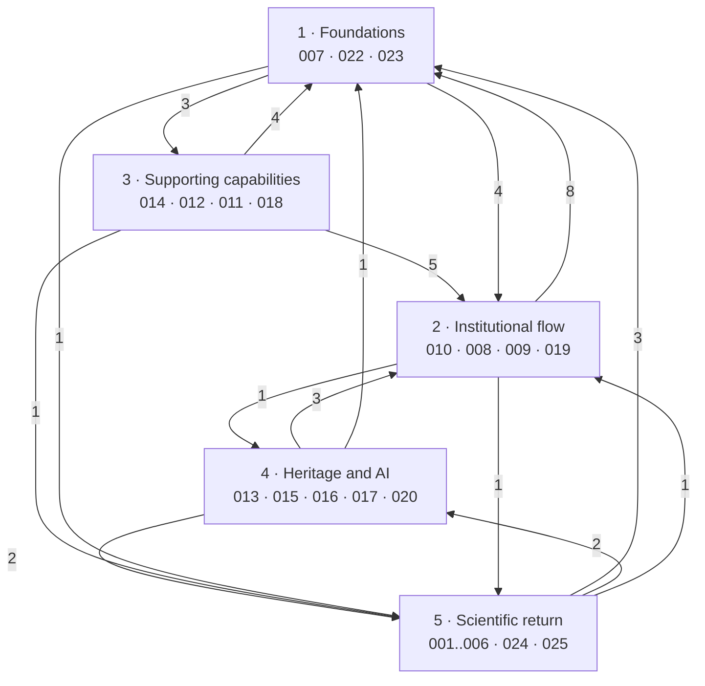

# Specifications (specs)

A spec describes **what the system does and under which rules**, starting from
behaviour that is already implemented and from its declared gaps. SPEC-021 is
the explicit exception: it describes requirements that are still unimplemented.
It differs from its neighbouring documents:

| Folder | Answers |
| --- | --- |
| `docs/api_contracts/` | How a caller talks to the system (cross-cutting HTTP rules) |
| `docs/proposals/` | What is intended and does not exist yet |
| `docs/specs/` | What the system guarantees (requirements, invariants, verifiable criteria) |

## Structure

```text
docs/specs/NNN-nome-curto/
  spec.md      # requirements, invariants, acceptance criteria
  plan.md      # optional: technical design, when the spec is written before the code
  tasks.md     # optional: executable breakdown
```

## Conventions

- Requirements numbered `FR-nnn`; invariants `INV-nnn`; acceptance criteria
  `AC-nnn`; declared gaps `GAP-nnn`.
- Not every spec numbers its criteria: eight of them (014–020 and 022) present
  acceptance as a *capability → automated evidence* table, sometimes followed by
  numbered scenarios. Both forms are accepted; what is not accepted is a
  criterion with no identifiable evidence.
- Every acceptance criterion points at the test that verifies it. A criterion
  with no test is a **declared** gap, not a silent omission.
- Every spec declares its implementation gaps as `GAP-nnn` — properties of the
  repository as it stands, not hypothetical future work.
- Published identifiers are stable: a resolved gap keeps its identifier
  reserved, without renumbering the ones that follow.
- References to Python tests use paths relative to `vitarerum-api/`, such as
  `test/context/test_module.py::test_case`, to tell files of the same name
  apart. The existence of the test does not, on its own, prove the whole
  guarantee cited.
- A spec favours observable behaviour; it includes implementation mechanisms
  when they explain guarantees or limits. Traceability to the code has a final
  section of its own.
- Every spec ends with open questions — decisions the code does not answer.
- The specs and this index are written in English; the folder names remain in
  Portuguese without accents.

## What the number means

The `NNN` is an **identifier, not a position**. It is assigned in the order the
specs were written — scientific return first, being the subject of the work —
and never changes, because it is cited by other specs, by the architecture, by
the ADRs and by work outside this repository.

It does not read as development order nor as dependency order, and it could
not:

- **Chronology**: the context of specs 001–006 arrived after the institutional
  core (2026-08-14), but before features 024 and 025. The first (2026-06-27) is
  the set 007, 008, 009, 010, 013, 015, 017, 022 and 023 — nine specs over
  seven contexts born in the same initial commit, and therefore in no order at
  all relative to one another.
- **Dependency**: the citation graph between specs **is not acyclic**. There are
  33 pairs citing each other (008↔009, 013↔015, 024↔025, among others), because
  an approved proposal *becomes* a project and a visit *produces* a report.
  There is no linear ordering to encode in a number. Reciprocal citations do not
  imply circular dependencies between modules at runtime.

The two readings a number cannot give are below: a reading path and the
dependency graph. The "Context since" column in the inventory gives the
chronology.

## Reading path

For someone arriving at the system, by layer. The order is pedagogical, not a
mandatory development or dependency sequence.

| # | Layer | Read in this order |
| --- | --- | --- |
| 1 | **Foundations** — who may act, and under which guarantees | [007](007-identidade-e-acesso/spec.md) identity → [022](022-cifragem-e-armazenamento/spec.md) encryption → [023](023-fronteiras-e-envelope-de-erro/spec.md) boundaries and error envelope |
| 2 | **Institutional flow** — the central life cycle | [010](010-submissao-publica/spec.md) public submission → [008](008-proposta-uso-de-colecoes/spec.md) proposal → [009](009-projeto-uso-de-colecoes/spec.md) project → [019](019-numeros-de-referencia/spec.md) reference numbers |
| 3 | **Supporting capabilities** — they serve the flow without taking part in it | [014](014-catalogo-e-indice-de-objetos/spec.md) catalogue → [012](012-modelos-de-documento/spec.md) templates → [011](011-perguntas-ao-museu/spec.md) questions → [018](018-notificacoes/spec.md) notifications |
| 4 | **Heritage and AI** — what the visit produces | [013](013-mapeamento-cidoc-crm/spec.md) CIDOC-CRM → [015](015-relatorio-visita-in-situ/spec.md) report → [016](016-prompts-versionados/spec.md) prompts → [017](017-narrativa-museologica/spec.md) narrative → [020](020-publicacao-externa/spec.md) external publication |
| 5 | **Scientific return** — the subject of the work | [001](001-investigacao-agentica-assistida/spec.md) assisted cycle → [002](002-vigilancia-retorno-cientifico/spec.md) watch → [003](003-pipeline-deterministico-bibliografico/spec.md) pipeline → [004](004-decisao-candidato-publicacao/spec.md) decision → [006](006-avaliacao-retorno-cientifico/spec.md) evaluation → [024](024-investigacao-agentica-autonoma/spec.md) autonomous cycle → [005](005-analise-agentica-de-candidato/spec.md) analysis and feedback → [025](025-base-de-conhecimento-curatorial/spec.md) curatorial memory |

Outside the path: [021](021-resumos-de-painel/spec.md) specifies what does not
exist yet.

### How the layers depend on one another



The arrows count distinct source/target pairs between specs of the two layers,
excluding the proposed SPEC-021. That they point both ways is the point: the
layers **compose**, they do not stack. A foundations spec cites the flow because
that is where the guarantee shows itself.

### Declared dependencies, by spec

Extracted from the `SPEC-NNN` citations inside each spec.

| Spec | Cites |
| --- | --- |
| 001 | 002, 003, 004, 005, 016, 022, 024 |
| 002 | 001, 003, 004 |
| 003 | 001, 002, 004, 006, 024 |
| 004 | 001, 002, 003, 009, 024 |
| 005 | 001, 002, 004, 016, 024, 025 |
| 006 | 001, 003, 024 |
| 007 | — |
| 008 | 007, 009, 010, 019, 022, 023 |
| 009 | 004, 008, 013, 019, 022, 023 |
| 010 | 007, 008, 019, 022, 023 |
| 011 | 010, 018, 021, 022 |
| 012 | 008, 010, 022 |
| 013 | 009, 015, 017 |
| 014 | 007, 008 |
| 015 | 009, 013, 016, 017 |
| 016 | 001, 005, 015, 017 |
| 017 | 013, 015, 016 |
| 018 | 002, 007, 008, 011 |
| 019 | 008, 009, 010 |
| 020 | 009, 013, 015, 017, 023 |
| 021 | 007, 008, 009, 011, 014, 018 |
| 022 | 002, 008, 009, 010, 011, 012, 014, 019, 023 |
| 023 | 007, 022 |
| 024 | 001, 002, 004, 022, 025 |
| 025 | 001, 004, 022, 024 |

The most cited are **022** (9 times), **001**, **008** and **009** (8), **002**
and **004** (7): these are the specs to read before touching any other. The only
one citing none is **007** — the system's entry point, on which everything else
depends.

## Inventory

"Context since" is the date of the first commit that introduced the bounded
context the spec describes — the real construction chronology, which the spec
number does not give. Specs 024 and 025 carry the date of the feature itself,
because they reached the `scientific_return` context after it already existed.

"Implemented" identifies an existing capability, not the absence of gaps: the
limits and unmet requirements are declared in each spec.


### Scientific return (`scientific_return`)

| Spec | Scope | Status | Context since |
| --- | --- | --- | --- |
| [SPEC-001](001-investigacao-agentica-assistida/spec.md) | Assisted agentic cycle (E1) | Implemented | 2026-08-14 |
| [SPEC-002](002-vigilancia-retorno-cientifico/spec.md) | Watch and review cadence | Implemented | 2026-08-14 |
| [SPEC-003](003-pipeline-deterministico-bibliografico/spec.md) | Deterministic discovery pipeline | Implemented | 2026-08-14 |
| [SPEC-004](004-decisao-candidato-publicacao/spec.md) | Curatorial decision and publication entry | Implemented | 2026-08-14 |
| [SPEC-005](005-analise-agentica-de-candidato/spec.md) | Agentic candidate analysis and curatorial feedback | Implemented | 2026-08-14 |
| [SPEC-006](006-avaliacao-retorno-cientifico/spec.md) | Empirical evaluation with live sources and models | Implemented | 2026-08-14 |
| [SPEC-024](024-investigacao-agentica-autonoma/spec.md) | Autonomous agentic cycle (full-agentic) | Implemented | 2026-08-24 |
| [SPEC-025](025-base-de-conhecimento-curatorial/spec.md) | Curatorial knowledge base | Implemented | 2026-08-24 |

### Institutional flow

| Spec | Context | Status | Context since |
| --- | --- | --- | --- |
| [SPEC-007](007-identidade-e-acesso/spec.md) | `identity` | Implemented | 2026-06-27 |
| [SPEC-008](008-proposta-uso-de-colecoes/spec.md) | `use_of_collections` — proposal phase | Implemented | 2026-06-27 |
| [SPEC-009](009-projeto-uso-de-colecoes/spec.md) | `use_of_collections` — project phase and journals | Implemented | 2026-06-27 |
| [SPEC-010](010-submissao-publica/spec.md) | `public_submission` | Implemented | 2026-06-27 |
| [SPEC-011](011-perguntas-ao-museu/spec.md) | `museum_questions` | Implemented | 2026-07-05 |
| [SPEC-012](012-modelos-de-documento/spec.md) | `document_templates` | Implemented | 2026-07-02 |
| [SPEC-014](014-catalogo-e-indice-de-objetos/spec.md) | `collection_object_index` | Implemented | 2026-07-04 |
| [SPEC-019](019-numeros-de-referencia/spec.md) | `reference_numbers` | Implemented | 2026-07-24 |
| [SPEC-018](018-notificacoes/spec.md) | `notifications` | Implemented | 2026-07-30 |

### Heritage, AI and dissemination

| Spec | Context | Status | Context since |
| --- | --- | --- | --- |
| [SPEC-013](013-mapeamento-cidoc-crm/spec.md) | `cidoc_crm.in_situ_visit_mapping` | Implemented | 2026-06-27 |
| [SPEC-015](015-relatorio-visita-in-situ/spec.md) | `reports.in_situ_visit` | Implemented | 2026-06-27 |
| [SPEC-016](016-prompts-versionados/spec.md) | `ai.prompts` | Implemented | 2026-07-18 |
| [SPEC-017](017-narrativa-museologica/spec.md) | `ai.museum_narrative` | Implemented | 2026-06-27 |
| [SPEC-020](020-publicacao-externa/spec.md) | `external_publications` | Implemented | 2026-07-30 |

### Cross-cutting

| Spec | Scope | Status | Context since |
| --- | --- | --- | --- |
| [SPEC-022](022-cifragem-e-armazenamento/spec.md) | Encryption at rest and file storage | Implemented | 2026-06-27 |
| [SPEC-023](023-fronteiras-e-envelope-de-erro/spec.md) | Context boundaries, layers and error envelope | Implemented | 2026-06-27 |

### Unimplemented

| Spec | Scope | Status | Context since |
| --- | --- | --- | --- |
| [SPEC-021](021-resumos-de-painel/spec.md) | Dashboard summaries | **Specified, not implemented** | — |

## Verification

The inventory covers every active bounded context listed in `AGENTS.md`.

### Review completed on 2026-09-06

- All 25 specs were read and cross-checked against one another and against the
  relevant code and test points. Python test paths were qualified and the gaps
  that did not yet have a `GAP-nnn` were identified.
- `python3 scripts/check_docs.py` and `git diff --check`: no errors.
- Targeted tests for investigation, grounding, provenance, identity,
  notifications and references: **115 passed**, with 5 warnings about
  SQLite/thread session cleanup. `uv run lint-imports`: **36 contracts kept,
  zero broken**. These runs happened on 2026-09-05.
- On 2026-09-06, an isolated in-memory SQLite trial confirmed the undue
  restoration of a cleared notification by a stale write (SPEC-018, GAP-016);
  another confirmed the invalid mask corrected in SPEC-019.
- The full backend/frontend suites and the PostgreSQL tests were not re-run; no
  external services or models were called. The full counts below are earlier
  records, not results of this run.

The documentation checker verifies references and routes by named segment; it
does not demonstrate exhaustive coverage of HTTP method/path pairs, nor the
semantic validity of each guarantee. The declared gaps prevail over a historical
coverage count.

### Earlier records

On 2026-08-18, while writing the specs:

- **Test references**: 692 `file::test` references checked against
  `vitarerum-api/test/`; zero missing.
- **Architectural boundaries**: `uv run lint-imports` — 36 contracts, 0 broken
  ([SPEC-023](023-fronteiras-e-envelope-de-erro/spec.md), AC-001).

On 2026-09-04, while adding coverage of the missing endpoints (SPEC-024,
SPEC-025 and additions to SPEC-009, SPEC-014, SPEC-015 and SPEC-017) and while
reconciling the specs with the code (divergences 3 to 5):

- **Test references**: checked by `scripts/check_docs.py`; **zero missing**. The
  checker no longer tolerates any.
- **Endpoint coverage**: every documented endpoint was compared with those cited
  in these specs, including the backend's local contract that had escaped
  consolidation. Gap: zero.

On 2026-09-05, in the global review of the 25 specs (divergences 6 to 13):

- **Documentation checker**: `python3 scripts/check_docs.py` — links, test
  references, status, diagrams, code citations and routes named by a spec: all
  ok.
- **Backend tests**: `uv run pytest` — 1373 pass, zero fail.
- **Frontend tests**: `npx ng test --no-watch` — 833 pass, **3 fail**, all now
  declared (divergence 13).
- **Architectural boundaries**: 36 `import-linter` contracts, 14 layer contracts
  — the numbers [SPEC-023](023-fronteiras-e-envelope-de-erro/spec.md) states.
- **Values checked against the code**: limits and defaults of SPEC-001,
  SPEC-003, SPEC-007, SPEC-014, SPEC-019 and SPEC-025 (`app/config.py`, password
  policies, rate limits, masks seeded by migration `0041`, evaluation fixture v3
  with 12 cases and 6 unmapped publications).

## Divergences found between contract and code

Raised while writing the specs, on 2026-08-18:

1. `GET /museum-questions/summary` was documented in contract 14 but **does not
   exist** — no route, use case or test
   ([SPEC-011](011-perguntas-ao-museu/spec.md), FR-017 and GAP-012). Besides
   that, as the routes are declared, `summary` would be captured by
   `GET /museum-questions/{questionId}`.
   *Resolved: the numbered contracts were consolidated into
   [`docs/api_contracts/README.md`](../api_contracts/README.md), which no longer
   mentions the endpoint; SPEC-011 keeps it as a reserved requirement.*
2. None of the four endpoints of contract 17 (dashboard summaries) exists
   ([SPEC-021](021-resumos-de-painel/spec.md)).
   *Resolved: contract 17 was moved to
   [`docs/proposals/`](../proposals/17Dashboard-Summary-API.md) and marked as an
   unimplemented proposal.*
Raised on 2026-09-04, while checking the test references, and **all resolved**
on the same date:

3. SPEC-005 described shadow generation, removed in commit `a571392`. Rewritten
   as [SPEC-005 — Agentic candidate analysis and curatorial
   feedback](005-analise-agentica-de-candidato/spec.md): generation went, the
   reader's analysis record and the curatorial feedback stayed, because they are
   still in code.
4. SPEC-004 documented deferral (`SNOOZE`, state `SNOOZED`), removed in commit
   `7ab131f` — withdrawn, with the requirements and criteria renumbered.
   [SPEC-002](002-vigilancia-retorno-cientifico/spec.md) described the cadence
   anchored on `lastRunAt`, replaced in commit `e4a4ce0` by the fixed grid from
   `scheduleAnchorAt` — FR-008, FR-010 and the criteria rewritten.
5. The Direction review flow (`refer-to-direction`, `return-to-staff`) was
   implemented and tested with no spec at all, documented only in a local
   backend contract. Absorbed by
   [SPEC-008](008-proposta-uso-de-colecoes/spec.md) (FR-014) and the contract
   removed.

Raised on 2026-09-05, in the global spec review, and **all resolved** on the
same date:

6. The identifiers followed two conventions — `RF`/`CA` in eleven specs and
   `FR`/`AC` in fourteen — after the translation into English. Normalised to
   `FR`/`INV`/`AC`/`GAP` throughout, and the conventions above rewritten to
   describe what the specs actually do.
7. SPEC-008 (FR-004) said the proposal receives `VRP-YYYYMMDD-XXXX` and the
   project `CUP-XXXXXXXX`. The masks seeded by migration
   `0041_reference_number_policies` are `PP-MUHNAC/COL/YYYY/XXXX` and
   `PR-MUHNAC/COL/YYYY/XXXX`; `VRP`/`CUP` are legacy formats, as
   [SPEC-009](009-projeto-uso-de-colecoes/spec.md) and
   [SPEC-019](019-numeros-de-referencia/spec.md) already said. Corrected.
8. SPEC-003 placed "autonomous investigation (SPEC-001)" out of scope; SPEC-001
   is the *assisted* cycle. Corrected, with SPEC-024 added.
9. SPEC-023 (FR-012) cited "SPEC-022, RF-003 and RF-008" for the corruption
   responses; the requirement is FR-011 of SPEC-022. Corrected.
10. This dependency table, the mutual-pair count, the most-cited specs and the
    layer graph were out of date against the real citations. Regenerated.
11. The context catalogue was incomplete: the
    [`module-boundaries.md`](../architecture/module-boundaries.md) did not list
    `external_publications` or `reference_numbers`, and the
    [`AGENTS.md`](../../vitarerum-api/AGENTS.md) omitted those two and also
    `notifications`. Both documents were completed, and
    `app/ai/museum_question_triage` now appears in both as an inactive
    scaffold. GAP-008 of
    [SPEC-023](023-fronteiras-e-envelope-de-erro/spec.md) was resolved and
    reserved. GAP-009 describes what remains: nothing verifies that a new
    context enters the catalogue.

Raised in the same review and **unresolved** — they stay declared in the specs:

12. The tables of the removed triage (`museum_question_triages`,
    `museum_question_triage_classifications`) remain in the schema, with no spec
    owning them and no retention decision
    ([SPEC-023](023-fronteiras-e-envelope-de-erro/spec.md), GAP-010, and
    [SPEC-011](011-perguntas-ao-museu/spec.md), GAP-006).
13. Three Angular component tests fail: two already declared by
    [SPEC-008](008-proposta-uso-de-colecoes/spec.md) (GAP-014) and a third, the
    hidden out-of-scope control, now declared by
    [SPEC-011](011-perguntas-ao-museu/spec.md) (GAP-008).

### Corrections and gaps from the review completed on 2026-09-06

The documentation divergences below were corrected. The code gaps were made
explicit, not implemented in this review.

| Specs | Correction or limit identified |
| --- | --- |
| 001, 002, 024 | Idempotent replay, manual execution and cadence separated. The autonomous cycle neither requires an active watch nor revalidates it in the worker (024, GAP-010). |
| 004, 005, 024 | The global queue omits other states by default (`PENDING`). Literal grounding does not prove object identity or exhaustive absence; the snapshot does not prove what the reviewer saw. |
| 007 | Recovery requests and confirmations share the per-IP limit instead of having independent quotas. |
| 008, 022 | Encryption after proposal materialisation delimited; the existing Secret Manager integration acknowledged, without confusing it with versioned rotation. |
| 009, 016 | Immutability limited to the operations actually prevented; notes/attachments and migrations are not covered by an absolute guarantee. |
| 011, 012, 013 | The absence of institutional ownership/filtering for questions, templates and mappings made explicit (GAP-015, GAP-013 and GAP-014, respectively). |
| 014, 015, 018 | Pagination lacks a total tie-breaker; the count of dependent reads corrected; the unsafe concurrency between marking and clearing notifications documented. |
| 019, 021 | Invalid mask example and the precedence of the three proposed summary routes corrected; contract duplication removed from SPEC-011. |
