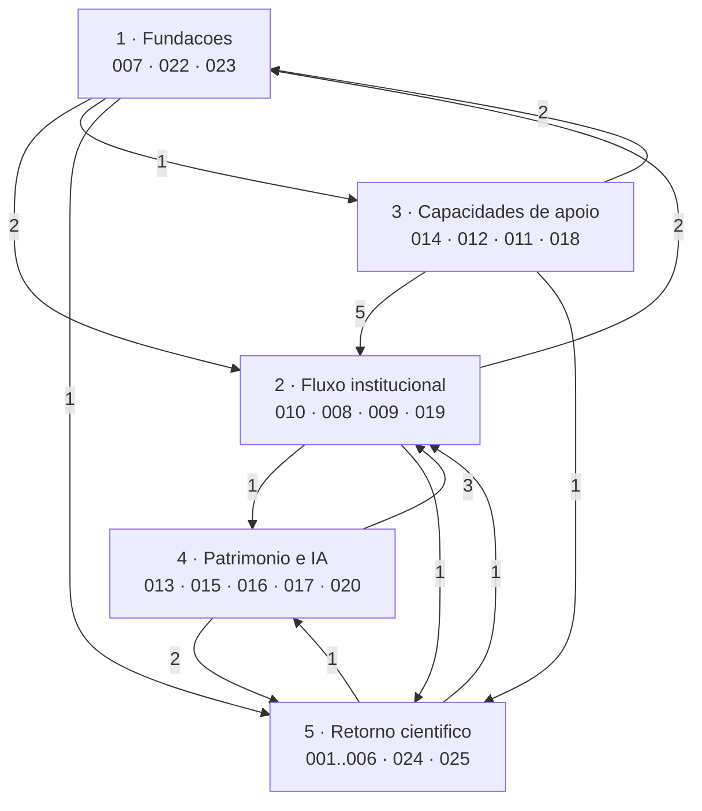

# Especificacoes (specs)

Uma spec descreve **o que o sistema faz e sob que regras**, a partir do
comportamento ja implementado. Distingue-se dos documentos vizinhos:

| Pasta | Responde a |
| --- | --- |
| `docs/api_contracts/` | Como se fala com o sistema (regras transversais de HTTP) |
| `docs/proposals/` | O que se pretende fazer e ainda nao existe |
| `docs/specs/` | O que o sistema garante (requisitos, invariantes, criterios verificaveis) |

## Estrutura

```text
docs/specs/NNN-nome-curto/
  spec.md      # requisitos, invariantes, criterios de aceitacao
  plan.md      # opcional: desenho tecnico, quando a spec e escrita antes do codigo
  tasks.md     # opcional: decomposicao executavel
```

## Convencoes

- Requisitos numerados `RF-nnn`; invariantes `INV-nnn`; criterios `CA-nnn`.
- Cada criterio de aceitacao aponta para o teste que o verifica. Um criterio sem
  teste e uma lacuna **declarada**, nao uma omissao silenciosa.
- A spec nao descreve implementacao; a rastreabilidade para o codigo vive numa
  seccao final propria.
- Cada spec termina com questoes em aberto — decisoes que o codigo nao responde.
- Texto sem acentos, por coerencia com o restante corpo de specs.

## O que o numero significa

O `NNN` e um **identificador, nao uma posicao**. E atribuido pela ordem por que
as specs foram escritas — o retorno cientifico primeiro, por ser o objeto do
trabalho — e nunca muda, porque e citado por outras specs, pela arquitetura,
pelos ADR e por trabalho externo a este repositorio.

Nao le como ordem de desenvolvimento nem como ordem de dependencia, e nao
podia:

- **Cronologia**: o que esta numerado 001–006 e o **ultimo** a ser construido
  (2026-08-14). O primeiro (2026-06-27) e o conjunto 007, 008, 009, 010, 013,
  015, 017, 022 e 023 — nove specs sobre sete contextos que nasceram no mesmo
  commit inicial, portanto sem ordem nenhuma entre si.
- **Dependencia**: o grafo de citacoes entre specs **nao e aciclico**. Ha 16
  pares mutuamente dependentes (008↔009, 013↔015, 024↔025, entre outros), porque
  uma proposta aprovada *torna-se* um projeto e uma visita *produz* um relatorio.
  Nao existe ordenacao linear para codificar num numero.

As duas leituras que um numero nao consegue dar estao abaixo: um percurso de
leitura e o grafo de dependencias. A coluna "Contexto desde" no inventario da a
cronologia.

## Percurso de leitura

Para quem chega ao sistema, por camadas. Dentro de cada camada a ordem e a
sugerida; entre camadas, cada uma assenta nas anteriores.

| # | Camada | Ler por esta ordem |
| --- | --- | --- | --- |
| 1 | **Fundacoes** — quem pode agir, e sob que garantias | [007](007-identidade-e-acesso/spec.md) identidade → [022](022-cifragem-e-armazenamento/spec.md) cifragem → [023](023-fronteiras-e-envelope-de-erro/spec.md) fronteiras e erro |
| 2 | **Fluxo institucional** — o ciclo de vida central | [010](010-submissao-publica/spec.md) submissao publica → [008](008-proposta-uso-de-colecoes/spec.md) proposta → [009](009-projeto-uso-de-colecoes/spec.md) projeto → [019](019-numeros-de-referencia/spec.md) numeros de referencia |
| 3 | **Capacidades de apoio** — servem o fluxo sem participar nele | [014](014-catalogo-e-indice-de-objetos/spec.md) catalogo → [012](012-modelos-de-documento/spec.md) modelos → [011](011-perguntas-ao-museu/spec.md) perguntas → [018](018-notificacoes/spec.md) notificacoes |
| 4 | **Patrimonio e IA** — o que a visita produz | [013](013-mapeamento-cidoc-crm/spec.md) CIDOC-CRM → [015](015-relatorio-visita-in-situ/spec.md) relatorio → [016](016-prompts-versionados/spec.md) prompts → [017](017-narrativa-museologica/spec.md) narrativa → [020](020-publicacao-externa/spec.md) publicacao externa |
| 5 | **Retorno cientifico** — o objeto do trabalho | [001](001-investigacao-agentica-assistida/spec.md) ciclo assistido → [002](002-vigilancia-retorno-cientifico/spec.md) vigilancia → [003](003-pipeline-deterministico-bibliografico/spec.md) pipeline → [004](004-decisao-candidato-publicacao/spec.md) decisao → [006](006-avaliacao-retorno-cientifico/spec.md) avaliacao → [024](024-investigacao-agentica-autonoma/spec.md) ciclo autonomo → [025](025-base-de-conhecimento-curatorial/spec.md) memoria curatorial |

Fora do percurso: [005](005-analise-llm-sombra/spec.md) descreve funcionalidade
removida (divergencia 4) e [021](021-resumos-de-painel/spec.md) especifica o que
ainda nao existe.

### Como as camadas dependem umas das outras



As setas contam citacoes entre specs das duas camadas. Que apontem nos dois
sentidos e o ponto: as camadas **compoem-se**, nao se empilham. Uma spec de
fundacoes cita o fluxo porque e ai que a garantia se manifesta.

### Dependencias declaradas, por spec

Extraidas das citacoes `SPEC-NNN` dentro de cada spec.

| Spec | Cita |
| --- | --- |
| 001 | — |
| 002 | 003, 004 |
| 003 | 001, 002, 004, 006 |
| 004 | 003, 009 |
| 005 | 001, 004, 016 |
| 006 | 001, 003 |
| 007 | — |
| 008 | 007, 009, 010, 019 |
| 009 | 004, 008, 013, 019 |
| 010 | 007, 008, 019 |
| 011 | 010, 018 |
| 012 | 008, 010 |
| 013 | 009, 015 |
| 014 | 007, 008 |
| 015 | 009, 013, 017 |
| 016 | 001, 005, 017 |
| 017 | 013, 015, 016 |
| 018 | 002, 007, 008, 011 |
| 019 | 008, 009, 010 |
| 020 | 009, 013, 015 |
| 021 | 008, 009, 011, 014 |
| 022 | 002, 009, 010, 011 |
| 023 | 007, 022 |
| 024 | 001, 002, 004, 025 |
| 025 | 001, 004, 024 |

As mais citadas sao 009 (8 vezes), 008 (7) e 004 e 001 (6 cada): sao as specs a
ler antes de mexer em qualquer outra. As unicas sem dependencias sao 007 e 001 —
os dois pontos de entrada do sistema.

## Inventario

"Contexto desde" e a data do primeiro commit que introduziu o contexto
delimitado que a spec descreve — a cronologia real de construcao, que o numero
da spec nao da. As specs 024 e 025 trazem a data da propria funcionalidade, por
terem chegado ao contexto `scientific_return` depois de ele existir.


### Retorno cientifico (`scientific_return`)

| Spec | Ambito | Estado | Contexto desde |
| --- | --- | --- | --- |
| [SPEC-001](001-investigacao-agentica-assistida/spec.md) | Ciclo agentic assistido (E1) | Implementado | 2026-08-14 |
| [SPEC-002](002-vigilancia-retorno-cientifico/spec.md) | Vigilancia e cadencia de revisao | Implementado | 2026-08-14 |
| [SPEC-003](003-pipeline-deterministico-bibliografico/spec.md) | Pipeline deterministico de descoberta | Implementado | 2026-08-14 |
| [SPEC-004](004-decisao-candidato-publicacao/spec.md) | Decisao curatorial e registo de publicacao | Implementado | 2026-08-14 |
| [SPEC-005](005-analise-llm-sombra/spec.md) | Analise LLM em sombra | Implementado | 2026-08-14 |
| [SPEC-006](006-avaliacao-retorno-cientifico/spec.md) | Avaliacao reprodutivel | Implementado | 2026-08-14 |
| [SPEC-024](024-investigacao-agentica-autonoma/spec.md) | Ciclo agentic autonomo (full-agentic) | Implementado | 2026-08-24 |
| [SPEC-025](025-base-de-conhecimento-curatorial/spec.md) | Base de conhecimento curatorial | Implementado | 2026-08-24 |

### Fluxo institucional

| Spec | Contexto | Estado | Contexto desde |
| --- | --- | --- | --- |
| [SPEC-007](007-identidade-e-acesso/spec.md) | `identity` | Implementado | 2026-06-27 |
| [SPEC-008](008-proposta-uso-de-colecoes/spec.md) | `use_of_collections` — fase de proposta | Implementado | 2026-06-27 |
| [SPEC-009](009-projeto-uso-de-colecoes/spec.md) | `use_of_collections` — fase de projeto e diarios | Implementado | 2026-06-27 |
| [SPEC-010](010-submissao-publica/spec.md) | `public_submission` | Implementado | 2026-06-27 |
| [SPEC-011](011-perguntas-ao-museu/spec.md) | `museum_questions` | Implementado (com uma lacuna declarada) | 2026-07-05 |
| [SPEC-012](012-modelos-de-documento/spec.md) | `document_templates` | Implementado | 2026-07-02 |
| [SPEC-014](014-catalogo-e-indice-de-objetos/spec.md) | `collection_object_index` | Implementado | 2026-07-04 |
| [SPEC-019](019-numeros-de-referencia/spec.md) | `reference_numbers` | Implementado | 2026-07-24 |
| [SPEC-018](018-notificacoes/spec.md) | `notifications` | Implementado | 2026-07-30 |

### Patrimonio, IA e difusao

| Spec | Contexto | Estado | Contexto desde |
| --- | --- | --- | --- |
| [SPEC-013](013-mapeamento-cidoc-crm/spec.md) | `cidoc_crm.in_situ_visit_mapping` | Implementado | 2026-06-27 |
| [SPEC-015](015-relatorio-visita-in-situ/spec.md) | `reports.in_situ_visit` | Implementado | 2026-06-27 |
| [SPEC-016](016-prompts-versionados/spec.md) | `ai.prompts` | Implementado | 2026-07-18 |
| [SPEC-017](017-narrativa-museologica/spec.md) | `ai.museum_narrative` | Implementado | 2026-06-27 |
| [SPEC-020](020-publicacao-externa/spec.md) | `external_publications` | Implementado | 2026-07-30 |

### Transversais

| Spec | Ambito | Estado | Contexto desde |
| --- | --- | --- | --- |
| [SPEC-022](022-cifragem-e-armazenamento/spec.md) | Cifragem em repouso, armazenamento e autorizacao partilhada | Implementado | 2026-06-27 |
| [SPEC-023](023-fronteiras-e-envelope-de-erro/spec.md) | Fronteiras de contexto, camadas e envelope de erro | Implementado | 2026-06-27 |

### Por implementar

| Spec | Ambito | Estado | Contexto desde |
| --- | --- | --- | --- |
| [SPEC-021](021-resumos-de-painel/spec.md) | Resumos de painel (dashboard) | **Especificado, nao implementado** | — |

## Verificacao

O inventario cobre todos os contextos delimitados ativos listados em
`AGENTS.md`.

Em 2026-08-18, ao escrever as specs:

- **Referencias a testes**: 692 referencias `ficheiro::teste` conferidas contra
  `vitarerum-api/test/`; zero inexistentes.
- **Fronteiras arquiteturais**: `uv run lint-imports` — 36 contratos, 0 quebrados
  ([SPEC-023](023-fronteiras-e-envelope-de-erro/spec.md), CA-001).

Em 2026-09-04, ao acrescentar a cobertura dos endpoints em falta (SPEC-024,
SPEC-025 e acrescentos a SPEC-009, SPEC-014, SPEC-015 e SPEC-017):

- **Referencias a testes**: 782 referencias conferidas; **6 inexistentes**, todas
  anteriores a esta revisao e todas por remocao de funcionalidade — ver
  divergencias 3 e 4 abaixo.
- **Cobertura de endpoints**: os endpoints documentados em
  `docs/api_contracts/` foram comparados com os citados nestas specs. A lacuna
  de 23 endpoints ficou fechada.

## Divergencias encontradas entre contrato e codigo

Levantadas ao escrever as specs, em 2026-08-18:

1. `GET /museum-questions/summary` esta documentado no contrato 14 mas **nao
   existe** — sem rota, caso de uso ou teste
   ([SPEC-011](011-perguntas-ao-museu/spec.md), RF-015). Alem disso, tal como as
   rotas estao declaradas, `summary` seria capturado por
   `GET /museum-questions/{questionId}`.
   *Assinalado no proprio contrato 14 como nao implementado.*
2. Nenhum dos quatro endpoints do contrato 17 (resumos de painel) existe
   ([SPEC-021](021-resumos-de-painel/spec.md)).
   *Resolvido: o contrato 17 foi movido para
   [`docs/proposals/`](../proposals/17Dashboard-Summary-API.md) e marcado como
   proposta nao implementada.*
Levantadas em 2026-09-04, ao conferir as referencias a testes:

3. **[SPEC-005](005-analise-llm-sombra/spec.md) descreve funcionalidade
   removida.** A analise LLM em sombra foi retirada no commit `a571392`
   ("AI shadow mode removal"); do codigo resta o modo de investigacao `SHADOW`
   em `domain/enums.py`, nao a analise que a spec documenta. Quatro das suas
   referencias a testes ja nao existem. A spec continua marcada `Implementado`
   no inventario acima — **o estado esta errado** e a decisao (corrigir ou
   arquivar) esta por tomar.
4. **[SPEC-004](004-decisao-candidato-publicacao/spec.md) documenta o
   adiamento (`SNOOZE`, estado `SNOOZED`, INV-004), removido no commit
   `7ab131f`.** [SPEC-002](002-vigilancia-retorno-cientifico/spec.md) CA-001
   aponta para um teste de ancoragem de cadencia substituido no commit
   `e4a4ce0`. Ambas precisam de revisao pontual, nao de arquivo.
